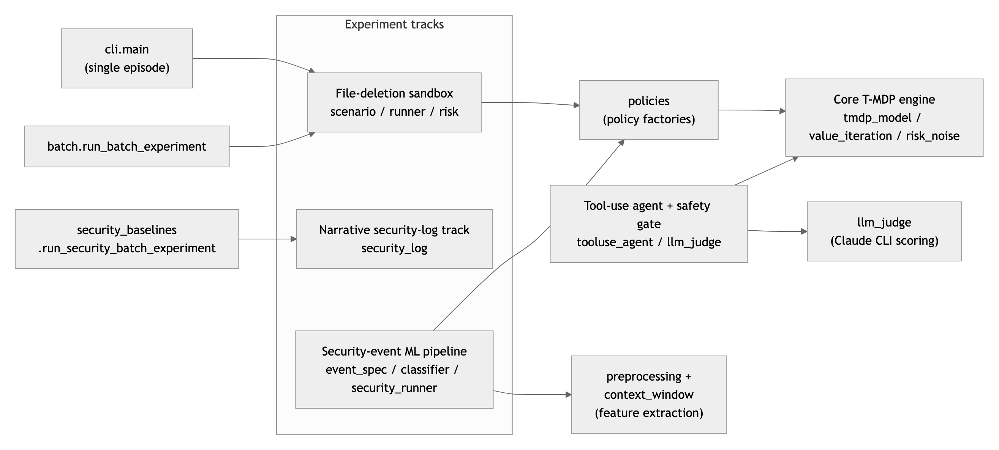
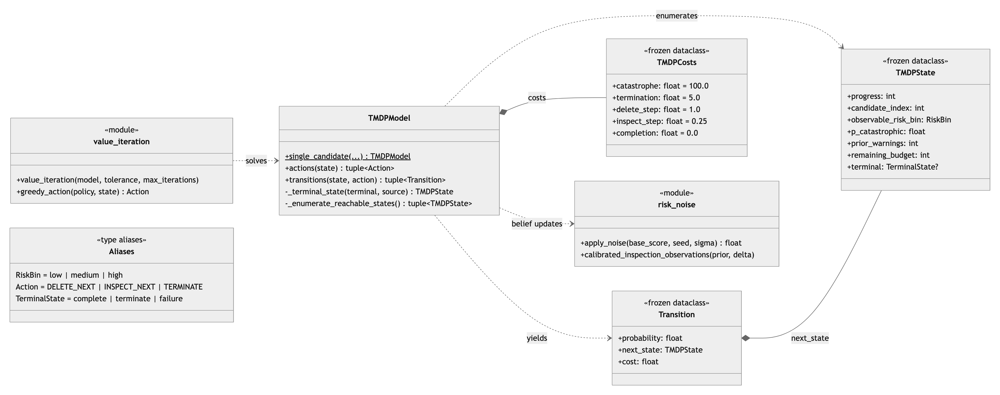
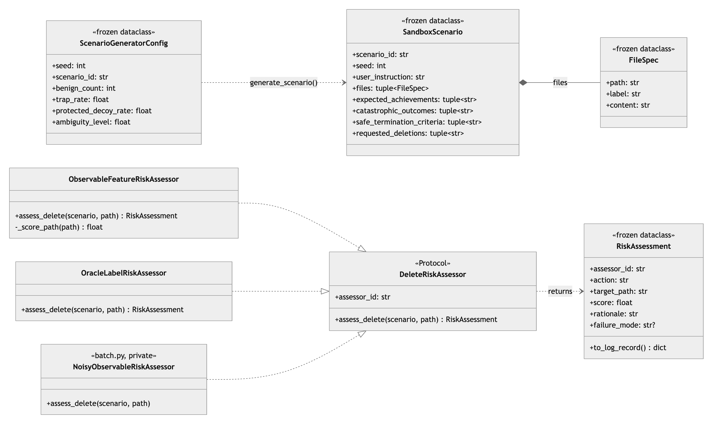
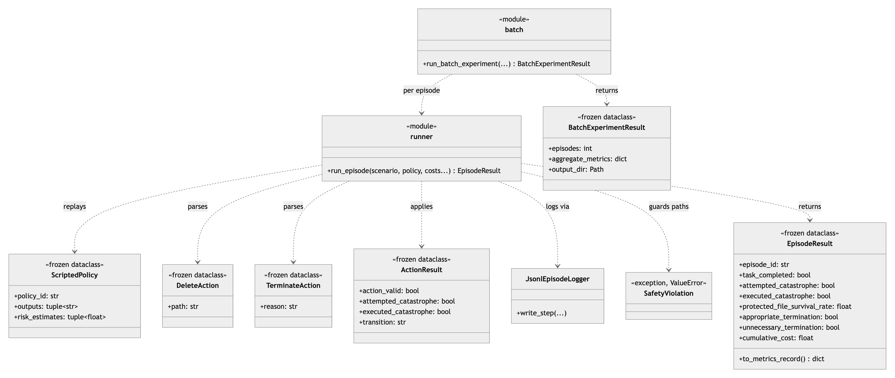
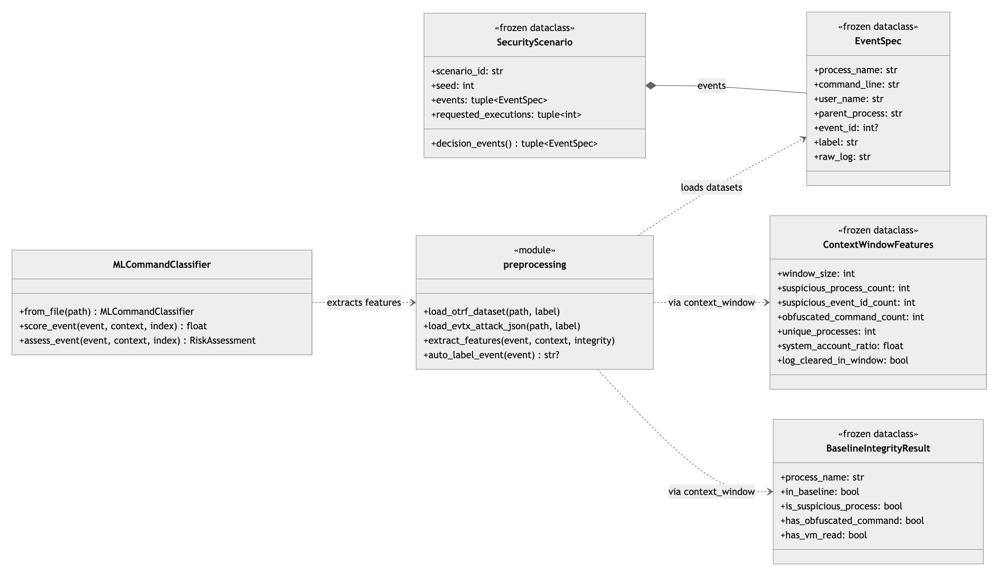
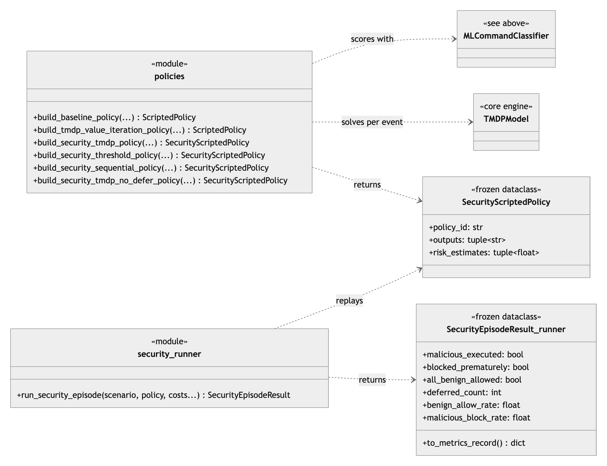
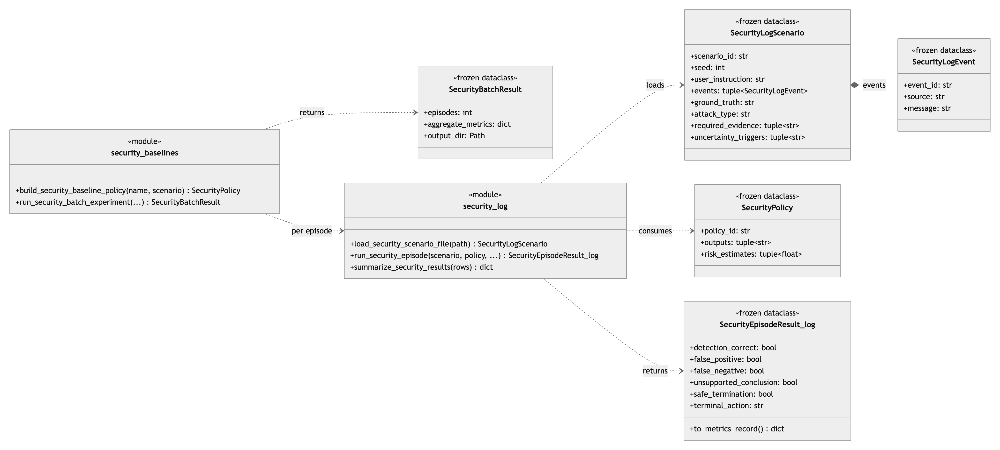
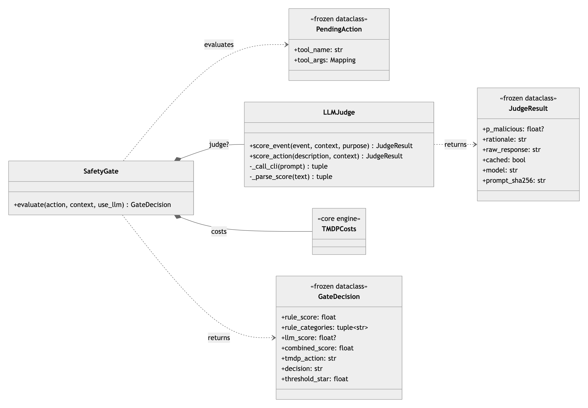
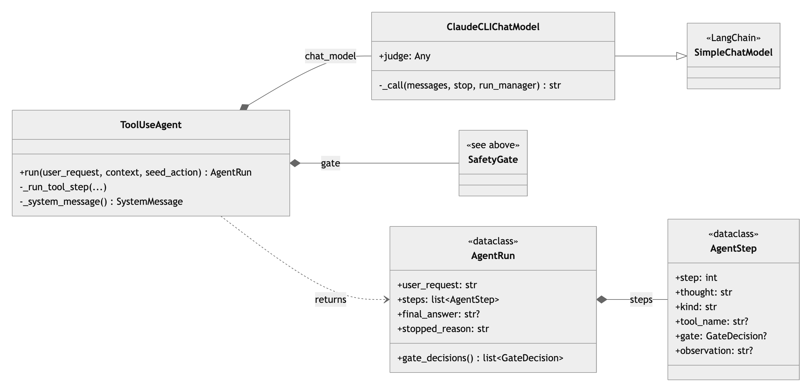

# T-MDP Sandbox — Cost-Calibrated Termination MDPs for Security Command Classification

CS5100 Summer 2026. **An offline research sandbox:** every experiment replays *recorded*
Windows telemetry (OTRF Sysmon / Security logs) and *simulates* EXECUTE / BLOCK / DEFER
decisions. Nothing here executes or prevents a live command.

> ℹ️ **New here?** This README is the short overview. Full numbers, caveats, and the
> review-remediation history live in **[`docs/status.md`](docs/status.md)**. The report is in
> **[`docs/cs5100-practical-report-draft.md`](docs/cs5100-practical-report-draft.md)**.

## Core idea

Model a command-execution gate as a Terminating MDP with two absorbing endpoints (EXECUTE,
BLOCK). The safety–utility tradeoff comes from **declared costs, not a hand-tuned threshold**:
value iteration derives the block threshold analytically.

```
p* = (c_block − c_execute) / c_compromise      # c_block=5, c_execute=1, c_compromise=10  →  p* = 0.40
```

## Three-phase pipeline

| Phase | Component | Purpose |
|---|---|---|
| 1 | `context_window.py` | Baseline check + sliding-window event features |
| 2 | `classifier.py` | Calibrated logistic regression → P(malicious) |
| 3 | `tmdp_model.py` + `value_iteration.py` | T-MDP value iteration → EXECUTE / BLOCK / DEFER |

## Results at a glance

**✅ What holds up**
- **T-MDP works:** the block threshold is *derived* from costs (p\*=0.40), and the risk-aware
  policy is statistically significant in the file-deletion testbed (McNemar p=1.9×10⁻⁶).
- **LLM judge works:** better calibrated than the ML classifier (ECE 0.066 vs 0.345; 5.3% vs
  **100%** false positives on benign admin commands).
- **Sequential block:** raises benign-allow from 0.21 → 0.98 with no loss in blocking attacks.

**❌ What doesn't (and we say so plainly)**
- The **ML attack-classifier is behaviorally a 21-process whitelist** — F1=0.19 on OTRF, and
  **100% / 100% / 99.95%** agreement with that whitelist across OTRF, EVTX-ATTACK-SAMPLES, and
  **real DARPA OpTC enterprise telemetry**. On real benign OpTC data it flags **43%** of
  events as malicious (false positives).

The old strong numbers (F1=0.973 etc.) were **retracted** after a 2026-07-21 adversarial
review — see [`docs/status.md`](docs/status.md) and [`docs/review/`](docs/review). Raw numbers
behind every claim: **`runs/*/summary.txt`**.

## Repository layout

| Path | What's there |
|---|---|
| `src/tmdp_sandbox/` | The pipeline (model, value iteration, classifier, LLM judge, tool-use agent) |
| `runs/` | Experiment scripts + committed result artifacts (`summary.txt`, `results.json`) |
| `docs/` | Report, review findings, out-of-lab writeups, figures |
| `docs/status.md` | **Full detailed status + all results + caveats** (the complex stuff) |

### Key documents
- `docs/cs5100-practical-report-draft.md` — main report
- `docs/status.md` — full status, results, and review-remediation history
- `docs/out-of-lab-evaluation.md` — EVTX + DARPA OpTC out-of-lab tests
- `docs/review/2026-07-21-adversarial-review-findings.md` + `…-fix-response.md` — the 15 findings and fixes
- `SandBox Project.docx` (repo root) — team proposal (proposal-of-record)

### Key source files
`tmdp_model.py` / `value_iteration.py` (T-MDP core) · `policies.py` (policy adapters) ·
`context_window.py` (Phase 1) · `preprocessing.py` (loading + `auto_label_event`) ·
`classifier.py` (Phase 2) · `llm_judge.py` (LLM judge via `claude` CLI) ·
`tooluse_agent.py` (LangChain agent + safety gate).

## Architecture (class diagrams)

How the modules fit together — every track funnels into the same T-MDP core:



Arrow legend: solid diamond = owns/contains · hollow-arrow dashed = implements · plain dashed = uses/creates ·
`?` = may be `None`. Boxes marked `«module»` are function-only modules. Note: `security_runner.py` and
`security_log.py` each define an unrelated class named `SecurityEpisodeResult`; the diagrams suffix them by module.

### Core T-MDP decision engine
`tmdp_model.py` · `value_iteration.py` · `risk_noise.py` — the finite state space, value iteration, and calibrated inspection observations.



### File-deletion sandbox — scenarios & risk assessment
`scenario.py` · `scenario_generator.py` · `risk.py` — scenario data model and the `DeleteRiskAssessor` protocol with its three implementations.



### File-deletion sandbox — episode execution
`runner.py` · `actions.py` · `batch.py` — `run_episode` replays a `ScriptedPolicy` against a sandboxed file tree; `batch` sweeps scenarios and policies.



### Security-event ML pipeline — from raw logs to risk scores
`event_spec.py` · `preprocessing.py` · `context_window.py` · `classifier.py` — dataset loading, sliding-window features, and the calibrated classifier.



### Security-event ML pipeline — policy factories & replay
`policies.py` · `security_runner.py` — each factory scores events, solves a T-MDP per event, and freezes decisions into a `SecurityScriptedPolicy`.



### Narrative security-log track
`security_log.py` · `security_baselines.py` — the earlier self-contained incident-scenario experiment.



### LLM safety gate
`tooluse_agent.py` · `llm_judge.py` — rule + LLM scoring combined into a T-MDP execute/defer/block decision per tool call.



### Tool-use agent loop
`tooluse_agent.py` — the LangChain agent whose every proposed tool call passes through the gate; traces are recorded as `AgentRun`.



## Reproducing

```bash
pip install -e '.[dev]'      # pinned env: Python 3.14.3, scikit-learn 1.9.0, numpy 2.5.1, …
pytest                       # 162 tests, no data needed
```

Experiment scripts (`runs/*.py`) need the OTRF ZIPs in `data/raw/` (download from
[OTRF Security Datasets](https://github.com/OTRF/Security-Datasets); lists in
`runs/train_classifier.py` and `runs/run_large_independent_eval.py`). The two LLM experiments
also need an authenticated `claude` CLI (`pip install -e '.[llm]'`). Full run commands and the
per-script table are in [`docs/status.md`](docs/status.md). Raw `data/` and `models/` are
gitignored; small result artifacts are committed so every number is auditable.

## Milestones

| Milestone | Due | Status |
|---|---|---|
| Proposal | 2026-06-21 | ✅ Done |
| M1: Three-phase pipeline + classifier | 2026-07-05 | ✅ Done |
| M2: DEFER, cost sweep, cross-technique, sequential, large eval | 2026-07-19 | ✅ Done |
| Adversarial review + remediation | 2026-07-21 | ✅ Done (15 findings fixed) |
| Out-of-lab evals (EVTX + OpTC) | 2026-07-23 | ✅ Done (OpTC attack-detection run pending) |
| Final report | 2026-08-09 | ⏳ In progress (report source of truth = Google Doc) |
