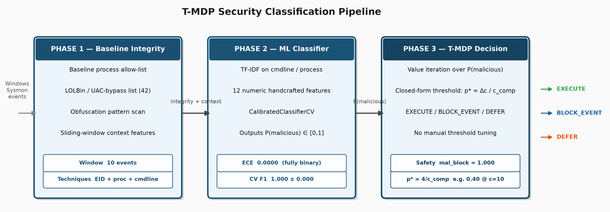

# Cost-Calibrated Termination MDPs for Security Command Classification

CS5100 Practical Track Report Draft

Draft due: 2026-08-02
Final due: 2026-08-09

Team: [User], Vaibhav, Patrick Xian

---

## Abstract

Autonomous agents that execute shell commands face a sequential decision problem: should the next command be executed, blocked, or deferred for human review? A malicious command that executes can cause irreversible system compromise; an unnecessary block interrupts legitimate work. We build a three-phase system that chains a baseline integrity check (Phase 1), an ML classifier (Phase 2), and a belief-state Termination MDP decision layer (Phase 3) to make this tradeoff explicit and tunable from cost parameters. All experiments are offline replays of recorded Sysmon / Windows Security telemetry: BLOCK is simulated on recorded events, and no live agent or execution path exists in the evaluated system.

Phase 2 trains a scikit-learn logistic regression pipeline on 11,935 labeled events auto-extracted from OTRF Security Datasets — 11,791 benign Windows process events and 144 malicious events from eight attack scenarios. An adversarial review of an earlier draft found that 438 of the original 618 malicious training labels (70.9%) were VirtualBox Guest Additions housekeeping polls (EID 10, GrantedAccess=0x1400, no PROCESS_VM_READ) mislabeled by a source-blind rule; the rule is now source- and mask-aware and the model was retrained. Five-fold cross-validation yields precision=recall=F1=1.000±0.000, but the training labels are a deterministic function of the feature inputs, so CV measures label recovery, not generalization (circular labels — Section 7.2). A held-out-ZIP evaluation within the Mordor/theshire lab environment (8,410 rule-labeled events across 15 OTRF ZIPs and 12 MITRE ATT&CK techniques, real k=10 context windows, labels committed before scoring) yields recall=0.955 (Wilson 95% CI [0.939, 0.967]) but 7,077 false positives on 7,544 benign events — precision=0.105 (Wilson 95% CI [0.098, 0.112]), F1=0.189. On this corpus the model's predictions coincide with a 21-entry process-name whitelist rule on all 8,410 events (100% agreement), and its F1 is below the trivial 3-process whitelist baseline (0.196): the evaluation quantifies rule agreement within one lab environment, not ML generalization. A hard-benign evaluation of 152 hand-authored benign administrative commands using non-whitelist processes finds a 100% false-positive rate at the deployed threshold. An earlier 30-event evaluation reporting F1=1.000 was retracted for test-set contamination (Section 6.7.1).

Phase 3 uses the classifier's P(malicious) as the catastrophe belief in a finite stochastic shortest-path T-MDP. Value iteration derives a block threshold analytically from declared costs: `p* = (c_block − c_execute) / c_compromise`. Under planning costs `c_compromise=10, c_block=5, c_execute=1`, the T-MDP threshold is `p*=0.4000` vs `0.5` for the scripted baseline (the evaluator separately charges `c_compromise=100` for an executed malicious command; Section 7.4). Because both policies see identical noise-perturbed scores and p* < 0.5, the T-MDP's executed set is a subset of threshold-0.5's — it cannot be worse by construction (c=0 is structural), and the empirical question is how often the policies diverge (b). In the 500-scenario noise sweep under the pinned environment, the two policies are identical at σ ≤ 0.15 (b=0) and diverge in 3 scenarios at σ=0.20 (exact McNemar p=0.25, Holm-adjusted p=1.0): no security-domain row is significant. The divergence window is populated in a controlled file-deletion domain, where the direction is likewise guaranteed by design and McNemar tests only whether divergences occur: b=20, c=0, exact p=1.91×10⁻⁶ at σ=0.15.

A sequential block architecture replaces the original episode-terminating BLOCK with per-event BLOCK_EVENT actions, raising benign_allow_rate from 0.209 → 0.978 with malicious_block_rate=1.000 maintained. The gain is structural, not inferential: stop-on-first forfeits every event after its first block, so the improvement held in 498/498 paired scenarios (exact sign test p=1.2×10⁻¹⁵⁰, reported descriptively). A threshold-0.5-sequential arm achieves the same gain (benign_allow=1.000, one malicious execution in 498 episodes), showing the improvement belongs to the architecture change, not to the T-MDP decision layer.

## 1. Problem Description and Motivation

Autonomous agents increasingly execute shell commands, run scripts, and call APIs in production environments. A compromised or deceived agent that executes a malicious command may cause irreversible damage: credential theft, persistence installation, lateral movement, or log tampering. The core challenge is that the agent must decide, event by event, whether a requested execution is safe — given only observable properties of the command (process name, command line, parent process, event ID) and the recent history of activity.

This is not purely a classification problem. Even a perfect classifier produces a probability estimate `P(malicious) ∈ [0, 1]`. The downstream action — execute, block, or defer — still requires a decision rule. A fixed threshold (block if `P > 0.5`) is the obvious baseline, but that threshold is chosen by intuition rather than by the actual costs of false positives (blocking legitimate work) and false negatives (executing malicious commands). In practice, the cost of executing a malicious command (system compromise) far exceeds the cost of an unnecessary block (user inconvenience), and the agent's decision rule should weight those asymmetrically.

The hypothesis tested here: a T-MDP provides a formally grounded decision layer that converts declared costs into an optimal threshold, outperforming a fixed threshold when evaluated under matched classifier noise. The T-MDP does not infer hidden malicious intent better than the classifier. It receives the same risk signal. Its value is that it derives the operating threshold from costs rather than from manual tuning.

The three-phase architecture makes the safety-utility tradeoff explicit and auditable:

- Phase 1 extracts handcrafted features from observable event properties (baseline process lists, obfuscation patterns, context window statistics);
- Phase 2 feeds those features into a calibrated ML classifier to produce `P(malicious)`;
- Phase 3 passes `P(malicious)` to a finite T-MDP whose cost parameters directly control the block threshold.

A practitioner can change `c_compromise` to shift the T-MDP's operating point without separately tuning a threshold.

## 2. Related Work

### 2.1 Decision-Theoretic Agent Safety

Our formulation belongs to a line of work on decision-theoretic approaches to AI safety, where agent shutdown, corrigibility, or risk-sensitive action selection is modeled as a sequential decision problem.

**Off-Switch Game.** Hadfield-Menell et al. (2017) model the shutdown problem as a cooperative two-player game: an agent that wants to complete its task may resist human interruption if it is sufficiently confident about its objective. The fix is to make the agent uncertain about its own utility, giving it incentive to defer to a human principal. Our work differs in three ways: (1) we make single-step event decisions rather than multi-step policy interruption; (2) there is no second player — the "human preference" is encoded as a declared cost ratio; and (3) the T-MDP agent voluntarily self-terminates when proceeding is more costly than stopping, which is the structural *opposite* of shutdown resistance.

**Stochastic Shortest Path MDPs.** Bertsekas and Tsitsiklis (1991, 1996) characterize undiscounted MDPs with absorbing terminal states. Their properness condition — that every proper policy reaches a terminal state with probability 1 and has finite expected cost — directly applies to our T-MDP formulation. Value iteration converges to the unique optimal cost-to-go for proper MDPs, giving the closed-form threshold derivation in Section 3.4.

**Termination MDPs.** Tennenholtz et al. (2022) define TerMDPs, where an external non-Markovian observer may terminate episodes independently of the agent's actions, and provide value functions over the joint agent-observer system. Our Phase 3 T-MDP differs in that termination is always *voluntary* (the agent chooses BLOCK or DEFER) and the termination belief comes from a learned classifier rather than an exogenous adversary.

**Risk-Sensitive MDPs.** Bäuerle and Jaśkiewicz (2024) survey risk-sensitive objectives: exponential utility, CVaR, and constrained failure probability. We adopt the simplest case — expected cost with a catastrophic terminal penalty — which reduces to a linear threshold. A practitioner wanting to minimize worst-case compromise probability rather than expected cost could substitute a CVaR criterion; the derivation would be more complex, but the three-phase architecture is unchanged.

### 2.2 Agentic Safety Benchmarks and Sandboxes

**ToolEmu.** Ruan et al. (2024) introduce an LLM-emulated sandbox evaluating whether LLM-based agents refuse dangerous tool calls across 36 simulated tool categories and 144 test cases, with a second LLM used as an automatic safety evaluator. Our architecture is structurally distinct: the "agent" is a structured log classifier followed by a cost-derived threshold, not an LLM reasoning about natural-language arguments. The evaluation unit — McNemar test on paired malicious-execution rates — is incompatible with ToolEmu's refusal-rate metric; Section 4.5 gives the full comparison rationale.

**Selectively Quitting.** Bonagiri et al. (2025) show in ToolEmu-style experiments that agents given explicit "you may quit" instructions achieve better safety–helpfulness tradeoffs than agents that must complete tasks or refuse them. Our DEFER action is the structural analog: it routes a borderline event to human review rather than committing to execute or block. DEFER is active in 1.13% of episodes in the noise-sweep batch (170/15,000; 241 DEFER events, all in the T-MDP arm) and nearly doubles benign_allow_rate at high compromise cost (0.141 vs 0.077 at c_compromise=50) by converting borderline blocks into deferred reviews rather than episode-ending refusals — a continuation effect under stop-on-first semantics (Appendix C).

**SafeToolBench and HAICOSYSTEM.** SafeToolBench (2025) and HAICOSYSTEM (2024) evaluate LLM agent behavior across natural-language task domains. We do not apply them directly because our evaluation unit — cost-weighted episode outcome in a structured Windows event log domain — is incompatible with their safety scoring rubrics (Section 4.5).

### 2.3 ML-Based Intrusion Detection

Our Phase 2 classifier sits within the ML intrusion detection lineage. Classical approaches include Snort-style signature matching, LSTM-based syscall sequence models, and graph-based process-tree analysis. Signature methods are brittle to novel techniques; deep sequence models are harder to calibrate and explain. We use logistic regression with TF-IDF on command-line text plus handcrafted event features — an interpretable pipeline whose in-distribution CV score (F1=1.000) must be read with the caveat that the training labels are a deterministic function of the same feature inputs (circular labels — Section 7.2). Cross-technique results (Section 6.1.1) are a development diagnostic, not independent evidence, because earlier feature and label edits were made against those held-out ZIPs. The near-binary score distribution on the training corpus (Section 6.5) is a construction artifact — the auto-labeler discards every ambiguous event, so a well-fit model saturates to 0/1 — and calibration metrics (ECE=0.000) are measurable only in the two occupied score regions, not at the decision threshold.

### 2.4 MITRE ATT&CK and OTRF Security Datasets

Our technique taxonomy uses the MITRE ATT&CK framework (Strom et al. 2018), which organizes adversarial behaviors into Tactics, Techniques, and Sub-techniques. The large held-out-ZIP evaluation (Section 6.7.2) covers 12 techniques across Credential Access, Lateral Movement, Persistence, Execution, and Discovery tactics; the initial 30-event evaluation (Section 6.7.1) covered five techniques but is retracted due to test-set contamination. Training data comes from the Open Threat Research Foundation (OTRF) Security Datasets (Rodriguez 2020) — controlled Sysmon and Windows Security event log recordings of simulated attacks.

---

## 3. Formal Model Statement

### 3.1 T-MDP / SSP formulation

The decision problem is modeled as a finite stochastic shortest-path-style Termination MDP:

`M = (S, A, P, c, s₀, G_execute, G_block, G_failure)`

where:

- `S` is the finite set of observable belief states;
- `A` is the action set: `EXECUTE`, `BLOCK`, `DEFER`;
- `P(s' | s, a)` is the transition kernel;
- `c(s, a, s')` is the immediate cost;
- `s₀` is the initial belief state for the current command decision;
- `G_execute` is the absorbing completion terminal state (command executed safely);
- `G_block` is the absorbing voluntary-block terminal state;
- `G_failure` is the absorbing catastrophic-failure terminal state (malicious command executed).

The batch adapter exposes `EXECUTE`, `BLOCK`, `BLOCK_EVENT`, and `DEFER` to the runner. `DEFER` is active in the noise-sweep batch (170/15,000 episodes, 1.13%; 241 DEFER events, all in the T-MDP arm); a no-defer variant is provided for controlled comparison. `BLOCK_EVENT` (block this specific event, continue processing) is the per-event action used by the sequential block policy (Section 6.6).

### 3.2 State representation

For one command decision, the T-MDP state is:

`state = (observable_risk_bin, p_malicious, prior_defers, remaining_budget, terminal)`

The load-bearing field is `p_malicious`, the policy's belief that executing this command will cause a catastrophic outcome. This belief comes from the Phase 2 classifier output and an optional seeded noise perturbation. Ground-truth labels are used only by the evaluator to determine whether an executed command was truly malicious.

### 3.3 Actions and transitions

- `EXECUTE`: attempts the command. With probability `p_malicious`, transitions to `G_failure`; with probability `1 − p_malicious`, transitions to `G_execute`.
- `BLOCK`: voluntarily refuses. Transitions to `G_block` with probability 1.
- `DEFER`: requests human review. In the solved per-event MDP, DEFER incurs the defer cost, updates belief from an inspection observation, and returns to the decision state. The evaluation harness implements a weaker semantics: DEFER is active in the batch runner (Section 3.1), but the review is never resolved — the episode charges the defer cost (0.5) and skips the event; the posterior re-decision that gives inspection its option value in the solved MDP is never executed. A deferred malicious event counts as blocked by metric definition (it was never executed), so DEFER-related safety metrics are partly true by construction (Section 7.5). The defer cost (0.5) is also priced below the execute cost (1), making triage of benign work cheaper than executing it — a harness pricing choice we flag rather than defend.

### 3.4 Costs and implicit threshold

Default cost form:

- execute step cost: `c_execute = 1`
- block cost: `c_block = 5`
- compromise cost: `c_compromise` (variable)
- defer cost: `c_defer = 0.5` (charged by the evaluation harness; the planner's inspection step cost defaults to 0.25 in `policies.py`)
- completion cost: `0`

For a command with belief `p`, executing has expected cost:

`E[EXECUTE] = (1 − p) · c_execute + p · (c_execute + c_compromise)`
`= c_execute + p · c_compromise`

Blocking costs:

`E[BLOCK] = c_block`

The policy should block when `E[BLOCK] < E[EXECUTE]`, which gives the correct T-MDP threshold:

`p* = (c_block − c_execute) / c_compromise`

Under the primary experiment settings (`c_block=5, c_execute=1, c_compromise=10`): `p* = (5 − 1) / 10 = 0.4000`.

The scripted threshold baseline uses `0.5`. With DEFER enabled, the deployed policy's actual structure (solved by value iteration) is EXECUTE for p ≤ 0.30, DEFER on (0.30, 0.50] — a value-of-information band — and BLOCK for p > 0.50; it does not simply block at 0.40. Because both policies receive identical noise-perturbed scores and every non-EXECUTE action stops the event, the T-MDP's executed set is a subset of threshold-0.5's under matched noise: divergence is one-sided by construction (the T-MDP can only be equal or safer), and the experiments measure how often divergence occurs, not its direction.

### 3.5 Properness and convergence

The T-MDP adapter is a finite-horizon SSP over one command at a time. Each per-command model has at most one inspection opportunity (`remaining_budget=1`). Because the reachable state space is finite and all policies are proper (terminal states are reachable from every nonterminal state), value iteration converges. This is a statement about the implemented sandbox model, not a general proof.

## 4. Methods

### 4.1 Three-phase pipeline



**Phase 1 — Baseline integrity check and context window features**

For each command-execution request, Phase 1 computes features from the event and a sliding window of the preceding 10 events:

- `in_baseline`: is the process name in a known-good whitelist (svchost, explorer, lsass, ...)?
- `is_suspicious_process`: is the process name in the known LOLBin list (powershell, cmd, reg, sc, certutil, ...)?
- `has_obfuscated_command`: does the command line match obfuscation patterns (base64, -enc, IEX, downloadstring, ...)?
- `event_id`: Sysmon/Windows Security event ID (process creation=1/4688, process access=10, registry=12/13);
- `ctx_suspicious_proc_count`, `ctx_obfuscated_count`, `ctx_log_cleared`: context window aggregate statistics.

**Phase 2 — ML classifier → P(malicious)**

A scikit-learn pipeline combining:
- TF-IDF vectorization on three text fields: `command_line`, `process_name`, `parent_process`
- StandardScaler on numeric Phase 1 features
- CalibratedClassifierCV wrapping LogisticRegression (`class_weight="balanced"`) or RandomForestClassifier

Output: `P(malicious) ∈ [0, 1]`, calibrated via isotonic regression.

**Phase 3 — T-MDP value iteration → EXECUTE / BLOCK / DEFER**

For each requested execution, Phase 3:
1. Maps `P(malicious)` to a `RiskBin` (low / medium / high);
2. Constructs a single-candidate T-MDP with the Phase 2 score as `p_catastrophic`;
3. Solves value iteration over the finite reachable state space;
4. Emits the greedy action at the initial state.

### 4.2 Datasets

**OTRF Security Datasets (malicious):** Eight attack-scenario recordings downloaded from the Open Threat Research Foundation. All datasets are Sysmon + Windows Security event logs in JSONL format (one event per line). Total: 52,072 raw events from defense evasion (stopping event logging via MiniNt registry key, three tool variants × two control sets) and privilege escalation (UAC bypass via fodhelper.exe, Fax service binary-path modification).

**Auto-labeling strategy:** Individual events within each OTRF dataset are labeled at the event level based on Sysmon event type and process metadata — not at the dataset level. This avoids the structural confound of "all OTRF events = malicious":

- *Malicious*: EventID=1/4688 with a LOLBin process name; EventID=10 (process access) targeting lsass.exe **only when the access mask includes dump-capable rights (PROCESS_VM_READ, 0x0010) and the source is not a baseline/agent process**; EventID=12/13 (registry write) matching persistence-path patterns; EventID=7 (image load) with unsigned DLL by a LOLBin.
- *Benign*: EventID=1/4688 with a known-good process (svchost, explorer, runtimebroker, ...) and no obfuscation patterns; normal registry ops by baseline processes; signed Microsoft DLL loads.
- *Excluded*: 40,137 events with insufficient signal (unknown process, ambiguous registry path, 0x1400-only process accesses, etc.).

**Label correction (2026-07-21 adversarial review, finding 8).** The original EID-10 rule was source- and mask-blind: it labeled *any* process access to lsass.exe/winlogon.exe malicious. The review found that 438 of the original 618 malicious training events (70.9%) were VirtualBox Guest Additions housekeeping polls — `vboxservice.exe` opening lsass/winlogon handles with GrantedAccess=0x1400 (QUERY_INFORMATION only, no PROCESS_VM_READ). None of the eight training scenarios contains credential-access activity, so these could not have been attack events; the classifier's "credential-access" signal was learned entirely from mislabeled hypervisor housekeeping. The rule is now mask- and source-aware, a `feat__has_vm_read` feature was added, and the model was retrained, shrinking the malicious training pool from 618 to 144 events.

Final labeled corpus: 11,935 events — 11,791 benign, 144 malicious (`data/processed/train_stats.json`). Class imbalance is handled by `class_weight="balanced"` in the logistic model; no downsampling is performed (an earlier draft described a downsampling step that the code never executes).

### 4.3 Seeded noise model

For noisy experiments, the Phase 2 classifier output is perturbed by seeded Gaussian noise and clipped to `[0, 1]`. The noise is deterministic given a scenario seed and event index. Primary noise levels: `sigma ∈ {0.00, 0.05, 0.10, 0.15, 0.20}`. The inspection observation model used by DEFER assumes review shifts belief by ±0.2 (`delta=0.2`, `risk_noise.py`) — a modeling assumption, not a measured review accuracy.

### 4.4 Scenario generation

SecurityScenario instances are constructed by sampling from the labeled event pools. Each scenario contains `length=20` events with a configurable fraction of malicious events (`mal_fraction ∈ {0.0, 0.1, 0.2, 0.3, 0.5}`). Events are shuffled into random order. The full batch contains 500 scenarios (100 per malicious fraction).

### 4.5 Evaluation protocol and external benchmark selection

This section states explicitly why no external IDS benchmark is used as a comparison point, since the absence is a deliberate methodological choice, not an oversight.

**Why standard IDS benchmarks do not apply.** CIC-IDS 2017/2018, UNSW-NB15, and NSL-KDD are the most commonly cited intrusion detection benchmarks. All three use network flow features (packet counts, byte rates, TCP flags, inter-arrival times). Our Phase 2 classifier operates on Windows host event fields: process names, command-line strings, Sysmon EventIDs, parent process chains, and context-window aggregates over preceding events. These feature spaces do not overlap. Reporting F1 on our system alongside a network-flow F1 would be a category comparison — equivalent to comparing a speech recognizer's word error rate to an image classifier's top-5 accuracy because both are "accuracy" numbers.

**Why OTRF is the correct reference dataset for this task.** The Open Threat Research Foundation Security Datasets is the primary public repository of labeled Sysmon + Windows Security event log captures from controlled attack simulations. Using it as the source for both training and evaluation is standard practice in the host-based detection literature (e.g., MITRE ATT&CK evaluation methodology uses similar Sysmon captures). Our cross-technique split — training on six stop-event-logging variants, testing on two held-out techniques (UAC bypass, service modification) — is a within-corpus transfer diagnostic; because feature and label lists were previously edited against those held-out ZIPs, it does not constitute an independent generalization evaluation (Section 6.1.1).

**Why ToolEmu / SafeToolBench / Risky-Bench do not apply to Phase 3.** These benchmarks test LLM-based agents deciding whether to call potentially dangerous tools given natural-language arguments. Our Phase 3 T-MDP receives a scalar `P(malicious) ∈ [0, 1]` from a structured log classifier and selects from three actions. The "agent" in these benchmarks is a language model; the comparison unit (refusal rate, safety score) has no analog to a cost-derived block threshold or a McNemar catastrophe rate. Drawing a numeric comparison would be comparing different architectures solving different problems with different evaluation protocols.

**What a sound external comparison would require.** The minimum bar for a valid external Phase 2 comparison is an independently labeled Sysmon event dataset with per-event ground-truth labels from a source not derived from OTRF. Such an evaluation has not been performed here, but it is achievable: the frozen `label_by_technique` protocol used in Section 6.7.2 could equally be applied to the EVTX-ATTACK-SAMPLES repository (sbousseaden) — an adapter for its format already exists in `preprocessing.py` — or to DARPA OpTC, which carries red-team ground truth and would require field mapping. Applying our own `auto_label_event` to such corpora would test labeling coverage rather than classifier generalization, but the pre-committed technique-rule protocol avoids that trap. An out-of-lab evaluation on a non-OTRF corpus is the required next step; every number in this report comes from the OTRF Mordor/theshire lab environment (Section 6.7.2, Section 7.5).

**Why this system does not use LangChain or an LLM-based Phase 2.** LangChain is a framework for building applications around large language models; using it here would mean replacing the scikit-learn classifier with an LLM that reads a command description and outputs P(malicious) in natural language. The design was considered and rejected for two reasons that are specific to the T-MDP contribution, not general objections to LLMs.

First, the T-MDP's optimality guarantee (`p* = (c_block − c_execute) / c_compromise`) holds only if the input probability is a calibrated frequency estimate — meaning P(malicious) = 0.7 should correspond to roughly 70% actual malicious events at that score. LLM-generated confidence numbers are not calibrated in this sense; they are verbal outputs that happen to contain digits. An uncalibrated input makes the derived threshold meaningless as a cost-optimal decision rule. We note the same standard limits our own claims: the Phase 2 scorer's calibration is measurable only where its output mass lies, and the training corpus contains no events near p*=0.40 (Section 6.5), so the frequency interpretation of our own threshold is also empirically untested.

Second, substituting an LLM for the classifier would merge two research variables — LLM judgment quality and T-MDP decision quality — into a single observed outcome. If the combined system performs well or poorly, the contribution cannot be attributed to the T-MDP layer specifically. The existing architecture keeps these layers cleanly separated: Phase 2 can be replaced by any calibrated scorer (logistic regression, random forest, or a future calibrated neural model) without modifying Phase 3. An LLM integration is a valid future experiment once calibration of LLM outputs has been demonstrated, but it is not a drop-in replacement for the current Phase 2.

**Measured update (2026-07-22).** The first rationale above was an assertion, and measuring it reversed it: Section 6.8 scores 542 events with both an LLM judge and the deployed classifier under identical reliability binning, and on every subset whose labels the classifier was not trained to reproduce, the LLM judge is the better-calibrated scorer (overall matched ECE 0.0663 vs 0.3447; hard-benign false-positive rate at p\* ≥ 0.40: 5.3% vs 100%). The design decision documented above stands as the design-time record, but its calibration premise is retracted: the honest remaining grounds for a classifier-only Phase 2 are operational (per-event LLM latency/cost, sampling nondeterminism, a 0.55% refusal rate, model-snapshot dependence) plus the attribution argument, which is unaffected. Sections 6.8 and 6.9 report the measurements; how this revision is presented in the final report is an open team decision.

### 4.6 Value iteration

For each per-event model, value iteration iterates over the finite reachable state space until the maximum value change falls below `tolerance=1e-6` (the production default; `1e-9` is used only in unit tests). The greedy action at the initial state determines the policy output. Because the state space is small (≤ 15 states per candidate), convergence is fast — under 1ms per candidate.

## 5. Experimental Setup

### 5.1 Classifier evaluation

**In-distribution:** five-fold stratified cross-validation on the full labeled corpus (11,935 events: 11,791 benign, 144 malicious after corrected source/mask-aware auto-labeling from 8 OTRF ZIPs). Metrics: precision, recall, F1 at threshold=0.5. Out-of-fold scores used for calibration measurement (ECE, MCE, Brier).

**Cross-technique:** held-out evaluation on 2 OTRF ZIPs not seen in training (`empire_uac_shellapi_fodhelper`, `cmd_service_mod_fax`). These cover UAC-bypass via fodhelper.exe and Fax-service binary-path modification — distinct from the stop-event-logging training techniques.

**Independent labeled:** 30 events hand-labeled by technique semantics (not `auto_label_event`), covering 5 MITRE ATT&CK categories: T1558.003, T1003.001, T1021.006, T1053.005, T1059.001. Ground truth was assigned by technique semantics rather than by the auto-labeler; the evaluation was nonetheless retracted for test-set contamination (Section 6.7.1) and superseded by the large held-out-ZIP evaluation (Section 6.7.2).

### 5.2 Security batch experiment

- 500 scenarios × 5 noise levels × 6 policies = 15,000 episodes
- Policies: `always-execute`, `threshold-0.3`, `threshold-0.5`, `threshold-0.7`, `tmdp-p*=0.40`, `oracle`
- T-MDP planning cost parameters: `c_compromise=10, c_block=5, c_execute=1` → `p*=0.4000`
- Evaluator cost parameters: `c_compromise=100` (actual damage if malicious command executes)
- Note the planner/evaluator mismatch: the planning `c_compromise=10` was pinned to place p* at 0.40 — a wedge-design choice creating a measurable divergence window below the 0.5 baseline — so the T-MDP as configured is not cost-optimal under the evaluation cost function. The matched-cost configuration (planner=evaluator=100, p*=0.04) is run in the Appendix C sweep. The proposal contained an internal contradiction here (it specified `c_compromise=100` while also declaring Threshold-0.4 as the T-MDP's implicit operating point, which requires c=10); the implementation kept the proposal's operating point for planning and its damage figure for evaluation.
- Noise sweep: sigma ∈ {0.00, 0.05, 0.10, 0.15, 0.20}
- Scenario composition: 20 events drawn uniformly from OTRF benign/malicious pools; malicious fraction ∈ {0.0, 0.1, 0.2, 0.3, 0.5}, 100 scenarios per fraction

### 5.3 Sequential block architecture evaluation

- 498 scenarios across malicious fractions {0.1, 0.2, 0.3}, sigma=0.15
- 6 policies: `tmdp-stop-on-first` (original), `tmdp-sequential` (BLOCK_EVENT), `threshold-0.5`, `threshold-0.5-sequential` (BLOCK_EVENT with the fixed-threshold decision layer), `oracle-stop`, `oracle-sequential`
- Statistics: exact sign test on per-scenario `benign_allow_rate` (paired by scenario), reported descriptively — the architectural gain is structural, not a sampled effect (Section 6.6)

### 5.4 Security cost sweep

- 500 scenarios × 4 cost levels × 4 policies = 8,000 episodes, sigma=0.15
- c_compromise ∈ {10, 50, 100, 500}; derived p* ∈ {0.400, 0.080, 0.040, 0.008}
- Policies: `tmdp-with-defer`, `tmdp-no-defer`, `threshold-0.5`, `oracle`
- Validates that T-MDP threshold tracks cost ratio monotonically

### 5.5 Metrics

Per-episode metrics:
- `malicious_executed`: at least one truly malicious command was allowed → system compromise
- `all_benign_allowed`: all benign commands were executed
- `benign_allow_rate`: fraction of benign decision events correctly executed
- `malicious_block_rate`: fraction of malicious decision events correctly blocked
- `cumulative_cost`: total step + compromise costs incurred

Aggregate comparisons:
- McNemar exact two-sided binomial test on `malicious_executed` (T-MDP vs threshold-0.5), per noise level, with Holm-Bonferroni adjustment across the five σ rows. The five rows reuse the same 500 scenarios under common random numbers (noise seed = scenario seed + step, σ-independent), so they form one correlated family: per-row p-values must not be combined across rows.
- Exact sign test on `benign_allow_rate` (sequential vs stop-on-first), per-scenario paired, reported descriptively (Section 6.6).

`malicious_executed` counts a deferred malicious event as blocked (it was never executed); DEFER-related safety numbers are therefore partly definitional (Section 3.3).

## 6. Results

### 6.1 Phase 2 Classifier Cross-Validation

Logistic regression pipeline, 5-fold stratified CV on the corrected corpus (11,935 events: 11,791 benign / 144 malicious; `data/processed/train_stats.json`):

| Metric | Mean | ±Std |
|---|---:|---:|
| Precision | 1.000 | 0.000 |
| Recall | 1.000 | 0.000 |
| F1 | 1.000 | 0.000 |

CV is now exactly perfect, and this carries no generalization information: `auto_label_event` is a deterministic function of fields present in the feature dict, so CV measures the model's ability to recover its own labeling rule. On the pre-correction corpus, the adversarial review verified zero conflicting labels across 2,294 unique per-event feature signatures, and a majority-vote lookup on just 5 scalar features achieved F1=0.971 — F1≈1 is a floor, not an achievement. The mechanism is unchanged by the label correction; the shrunken, more homogeneous malicious class (144 events) makes rule recovery easier, so the circularity caveat is *more* acute after correction, not less. Additionally, `_cross_validate` uses row-level StratifiedKFold after full-corpus feature extraction: in the pre-correction corpus 88.3% of events shared an exact per-event feature signature with another event, pairing duplicates across folds (the shuffle before context extraction also makes context-window features meaningless at training time). No group-wise (per-ZIP) or deduplicated CV number exists in the regenerated artifacts; the row-level number above should be read strictly as label recovery.

### 6.1.1 Cross-Technique Transfer (Development / Diagnostic Evaluation)

Trained on 6 stop-event-logging ZIPs (cmd/psh/reg × 2 control-set variants; 10,451 events — 10,397 benign / 54 malicious); evaluated on 2 held-out ZIPs representing unseen attack techniques: `empire_uac_shellapi_fodhelper` (UAC bypass via fodhelper.exe) and `cmd_service_mod_fax` (Fax service binary-path modification). Regenerated results under the corrected labels:

| Dataset | n | benign | malicious | Precision | Recall | F1 |
|---|---:|---:|---:|---:|---:|---:|
| empire_uac_shellapi_fodhelper | 1,394 | 1,323 | 71 | 1.000 | 1.000 | 1.000 |
| cmd_service_mod_fax | 90 | 71 | 19 | 1.000 | 1.000 | 1.000 |
| **Overall test** | **1,484** | **1,394** | **90** | **1.000** | **1.000** | **1.000** |

TP=90, FP=0, TN=1,394, FN=0; malicious score mean 0.9964, benign score mean 0.000. This evaluation is retitled a *development/diagnostic* result and cannot support an independent generalization claim, by the same standard used to retract Section 6.7.1: an earlier iteration on these same ZIPs raised recall 0.639 → 0.815 by expanding `_SUSPICIOUS_PROCESSES` with UAC-bypass launchers (`fodhelper.exe`, `eventvwr.exe`, `sdclt.exe`), adding UAC-bypass registry paths to `_PERSISTENCE_RE`, and adding `feat__is_attack_eid` — then re-scoring the same ZIPs. That was tune-on-test, and the edits remain in the feature and label lists used here. Editing the label rules also changed the test set's label composition (empire_uac's malicious count went ~61 → 81 in the pre-correction vintage; it is 71 under the corrected rules), so part of the earlier "gain" measured labeling coverage rather than classifier behavior. The only untainted cross-technique measurement is the first-pass recall of 0.639.

The pre-correction draft reported this evaluation as F1=0.921 with an "honest generalization gap"; under the corrected labels that gap is gone — the events the old model missed were removed or relabeled by the corrected rules. The perfect post-correction score should be read through Section 6.1's mechanism (labels are a deterministic function of the feature vocabulary) and Section 6.7.2's environment caveat (both held-out ZIPs come from the same lab environment as training).

### 6.2 Security Batch — Noise-Free Baseline (sigma=0.00)

| Policy | Mal.Exec Rate | Ben.Allow Rate | Mal.Block Rate | Avg Cost |
|---|---:|---:|---:|---:|
| always-execute | 0.800 | 1.000 | 0.200 | 460.00 |
| threshold-0.3 | 0.000 | 0.336 | 1.000 | 10.15 |
| threshold-0.5 | 0.000 | 0.336 | 1.000 | 10.15 |
| threshold-0.7 | 0.000 | 0.336 | 1.000 | 10.15 |
| tmdp-p*=0.40 | 0.000 | 0.336 | 1.000 | 10.15 |
| oracle | 0.000 | 0.336 | 1.000 | 10.15 |

*Notes:* `mal_fraction=0.0` scenarios (20% of total) contribute `ben_allow_rate=1.0`. For mixed scenarios the policy blocks at the first malicious event, leaving subsequent benign events unprocessed — this drives `ben_allow_rate` below 1.0 even for oracle. The `blocked_prematurely` metric flags any block where unprocessed benign events remain; it is expected to be high for mixed scenarios regardless of policy quality.

At σ=0.00 (and σ=0.05) every policy except always-execute produces literally identical results. The retrained classifier's scores on this event pool sit far from every tested threshold, so threshold-0.3/0.5/0.7, T-MDP, and oracle make the same decision on every event. (The pre-correction draft reported threshold-0.5 allowing 1.4% malicious executions at σ=0; those borderline scores came from the mislabeled training pool and no longer exist.) The T-MDP row's p*=0.40 comes from planning costs pinned for the wedge design (planner `c_compromise=10` vs the evaluator's 100 — Section 7.4); Appendix C's `c_compromise=100` row is the matched-cost configuration.

### 6.3 Security Batch — Full Noise Sweep

| sigma | Policy | Mal.Exec | Ben.Allow | Mal.Block | Avg Cost |
|---:|---|---:|---:|---:|---:|
| 0.00 | threshold-0.3 | 0.000 | 0.336 | 1.000 | 10.15 |
| 0.00 | threshold-0.5 | 0.000 | 0.336 | 1.000 | 10.15 |
| 0.00 | threshold-0.7 | 0.000 | 0.336 | 1.000 | 10.15 |
| 0.00 | tmdp-p*=0.40 | 0.000 | 0.336 | 1.000 | 10.15 |
| 0.05 | threshold-0.3 | 0.000 | 0.336 | 1.000 | 10.15 |
| 0.05 | threshold-0.5 | 0.000 | 0.336 | 1.000 | 10.15 |
| 0.05 | threshold-0.7 | 0.000 | 0.336 | 1.000 | 10.15 |
| 0.05 | tmdp-p*=0.40 | 0.000 | 0.336 | 1.000 | 10.15 |
| 0.10 | threshold-0.3 | 0.000 | 0.336 | 1.000 | 10.14 |
| 0.10 | threshold-0.5 | 0.000 | 0.336 | 1.000 | 10.15 |
| 0.10 | threshold-0.7 | 0.004 | 0.337 | 1.000 | 10.56 |
| 0.10 | tmdp-p*=0.40 | 0.000 | 0.336 | 1.000 | 10.14 |
| 0.15 | threshold-0.3 | 0.000 | 0.285 | 1.000 | 9.43 |
| 0.15 | threshold-0.5 | 0.000 | 0.336 | 1.000 | 10.15 |
| 0.15 | threshold-0.7 | 0.024 | 0.339 | 0.996 | 12.60 |
| 0.15 | tmdp-p*=0.40 | 0.000 | 0.329 | 1.000 | 10.09 |
| 0.20 | threshold-0.3 | 0.000 | 0.212 | 1.000 | 8.52 |
| 0.20 | threshold-0.5 | 0.006 | 0.319 | 0.999 | 10.52 |
| 0.20 | threshold-0.7 | 0.050 | 0.343 | 0.991 | 15.49 |
| 0.20 | tmdp-p*=0.40 | 0.000 | 0.300 | 1.000 | 9.74 |

**McNemar test: T-MDP vs threshold-0.5 on malicious-execution outcome** (exact two-sided binomial, paired on `malicious_executed`; Holm-Bonferroni across the five correlated σ rows; χ² with continuity correction shown as secondary reference)

| sigma | n | b (T-MDP saves) | c (thresh saves) | exact p | χ² (cc) | Holm p |
|---:|---:|---:|---:|---:|---:|---:|
| 0.00 | 500 | 0 | 0 | 1.000 | 0.00 | 1.000 |
| 0.05 | 500 | 0 | 0 | 1.000 | 0.00 | 1.000 |
| 0.10 | 500 | 0 | 0 | 1.000 | 0.00 | 1.000 |
| 0.15 | 500 | 0 | 0 | 1.000 | 0.00 | 1.000 |
| 0.20 | 500 | 3 | 0 | 0.250 | 1.33 | 1.000 |


No security-domain McNemar row is significant. At σ ≤ 0.15 the T-MDP and threshold-0.5 are literally identical on all 500 scenarios (b = c = 0); at σ=0.20 the T-MDP saves 3 scenarios (exact p=0.25, Holm-adjusted p=1.0). Note that c=0 in every row is *structural*, not empirical: under matched noise and p* < 0.5 the T-MDP's executed set is a subset of threshold-0.5's (Section 3.4), so McNemar here can only test whether one-sided divergences occur (b > 0). These b counts are also environment-sensitive: in the original (unpinned) environment they ranged 2–6 per row, resting on ≤7 borderline-scored events whose calibrated scores moved under different library versions; the table above is from the pinned environment (Python 3.14.3, scikit-learn 1.9.0 — Appendix A). The underlying cause of the near-empty divergence window is the labeling scheme, not attack distinctiveness: the retrained classifier's output is fully binary on this pool (Section 6.5), so essentially no noisy scores land in the (0.30, 0.50] band where the two policies' actions differ, even at σ=0.20.

DEFER activity in this batch: the tmdp-p*=0.40 arm is the only arm that defers — 170 of its 2,500 episodes (1.13% of all 15,000 episodes) contain at least one DEFER, 241 DEFER events in total.

### 6.4 T-MDP Theoretical Validation (File-Deletion Domain)

The T-MDP framework was validated on a controlled file-deletion sandbox; this experiment is classifier-independent and was regenerated in the pinned environment (`runs/fair_batch/fair_comparison_cat10/`), reproducing the original result:

**Value iteration threshold test:** For `c_catastrophe=10, c_terminate=5, c_delete=1`, value iteration places the decision boundary at `p*=0.4000`. Confirmed by unit test (`test_value_iteration_threshold_matches_cost_formula`): DELETE at `p=0.39`, TERMINATE at `p=0.41`.

**Paired comparison at sigma=0.15 (300 scenarios = 100 seeds × 3 ambiguity levels; 3,000 episodes across both σ values and 5 policies):**
- T-MDP catastrophe rate: 0.477
- Observable threshold (0.5) catastrophe rate: 0.543
- Discordant pairs: b=20 (T-MDP safe, threshold catastrophe) vs c=0 (reverse)
- McNemar exact two-sided p = 1.91 × 10⁻⁶ (recomputed for this report from the regenerated `episodes_all.jsonl`, paired on scenario id; the fair-batch script emits no mcnemar.json artifact)

Two caveats accompany this p-value. First, the structural c=0 property of Section 3.4 applies here too: under matched noise the T-MDP cannot lose a pair, so McNemar tests only whether the divergence window is populated (b > 0), not a symmetric contest. Second, the per-ambiguity decomposition (regenerated episodes, σ=0.15) shows where the discordance lives: the ambiguity=0.0 informative stratum contributes b=11 (catastrophe rates 0.010 T-MDP vs 0.120 threshold), ambiguity=0.5 contributes b=8 (0.430 vs 0.510), and the ambiguity=1.0 uninformative control contributes b=1 (0.990 vs 1.000). The pooled 143/300 both-catastrophe count is dominated by the ambiguity=1.0 control, where both policies fail by design; the T-MDP's advantage concentrates exactly where the signal is informative. At σ=0.00 the policies are identical (b=c=0, p=1.0), the expected null without noise.

**Cost sensitivity sweep:** an earlier draft reported a file-deletion cost sweep (catastrophe rate falling 0.430 → 0.100 as `c_catastrophe` rose 10 → 500). That run predates the pinned environment and has not been regenerated, so its numbers are not restated here [file-deletion cost-sweep regeneration pending]. The regenerated security-domain cost sweep (Appendix C) demonstrates the same monotone threshold-tracking property.

### 6.5 Phase 2 Classifier Calibration

The T-MDP's optimality guarantee requires that P(malicious) is a *calibrated frequency estimate*: a score of 0.40 should mean approximately 40% of events at that score are genuinely malicious. We measured calibration with ECE (Expected Calibration Error), MCE (Maximum Calibration Error), and Brier score using two test sets. All numbers below are from the single regenerated calibration run (`runs/calibration_eval/`, pinned environment).

**In-distribution (5-fold OOF, n=11,935: 144 malicious / 11,791 benign):**

| Score range | n | Mean predicted | Actual rate | Gap |
|---|---:|---:|---:|---:|
| [0.0–0.1] | 11,791 | 0.0000 | 0.0000 | 0.0000 |
| (0.1–0.9) — 8 bins | 0 | — | — | — |
| [0.9–1.0] | 144 | 0.9996 | 1.0000 | 0.0004 |

ECE=0.0000 · MCE=0.0004 · Brier=0.0000

**Cross-technique (empire_uac + cmd_service_mod_fax, n=1,484: 90 malicious / 1,394 benign):**

| Score range | n | Mean predicted | Actual rate | Gap |
|---|---:|---:|---:|---:|
| [0.0–0.1] | 1,394 | 0.0000 | 0.0000 | 0.0000 |
| (0.1–0.9) — 8 bins | 0 | — | — | — |
| [0.9–1.0] | 90 | 0.9995 | 1.0000 | 0.0005 |

ECE=0.0000 · MCE=0.0005 · Brier=0.0000


**Interpretation.** After label correction the classifier's output is *fully* binary: 8 of 10 bins are empty in both test sets, and zero events fall anywhere in (0.1, 0.9). (The pre-correction draft had 7 mid-range in-distribution events and reported MCE=0.5533 from a 2-event bucket; those events came from the mislabeled pool and no longer exist.) The near-zero ECE is therefore *not* evidence that scores are meaningful probabilities. It measures self-agreement with the auto-labeler in the two occupied extremes: the labels are a deterministic, ambiguity-filtered function of the features (Section 7.2), so any well-fit model saturates to 0/1 and trivially matches its own rule at both ends. There is now no empirical support that a score of 0.40 corresponds to any observable malicious frequency — no events score near 0.40 in either set — so the frequency interpretation of p*=0.40 is untestable on this corpus.

Two further disclosures. First, calibration was measured on the raw pipeline's `predict_proba`, but the *deployed* scorer (`MLCommandClassifier.score_event`) adds a deterministic override returning 0.99 for any event with an ID in `_ATTACK_EVENT_IDS` (`classifier.py`). That override — introduced in response to the retracted 30-event evaluation (Section 6.7.1) — is a rule layered outside the calibrated scorer, and its calibration is untestable on this corpus because the auto-labeler defines those same EIDs as malicious; in the real world it would deterministically flag benign administrative events (EIDs 4698/4720/7045, e.g. legitimate scheduled-task creation) with no calibration metric registering the error. Second, we ran no calibrator ablation (uncalibrated vs sigmoid vs isotonic score histograms), so we cannot attribute the binary shape to the data rather than the isotonic calibrator; the labeling-mechanism explanation above is the more parsimonious account, and the claim that the shape is "a property of the data" made in earlier drafts is withdrawn as untested.

"Operational validity" of p*=0.40 must therefore be scoped: on the training and cross-technique corpora the divergence zone is empty and the extreme bins are accurate, so any threshold placed between the two score modes yields identical decisions. Out of distribution this breaks down: in the large held-out evaluation (Section 6.7.2), all 7,077 false positives score in [0.400, 0.434] — marginally above p*=0.40 — so there the threshold choice is decisive (a 0.5 threshold would not have flagged them), and in the hard-benign evaluation the FP rate at p*=0.40 is 100%. The empty divergence zone is also why the security-domain McNemar test has no power (Section 6.3).

Calibration scripts and output: `runs/run_calibration_eval.py`, `runs/calibration_eval/`

### 6.6 Sequential Block Architecture

The original policy architecture stops the entire episode on the first BLOCK decision ("stop-on-first"). A new "sequential block" policy (`build_security_sequential_policy`) applies the same per-event T-MDP value iteration but emits `BLOCK_EVENT` (refuse this specific event, continue) rather than `BLOCK` (refuse all remaining events and stop). This lets benign events that follow a malicious event still execute.

Evaluated across 498 scenarios at three malicious fractions (10%, 20%, 30%), sigma=0.15, p*=0.40; 6 arms × 498 = 2,988 episodes:

| Policy | Mal.Exec | Ben.Allow | Mal.Block | Avg Cost | Cost/Decision | Avg Defer |
|---|---:|---:|---:|---:|---:|---:|
| tmdp-stop-on-first | 0.000 | 0.209 | 1.000 | 8.51 | 1.870 | 0.080 |
| tmdp-sequential | 0.000 | 0.978 | 1.000 | 35.82 | 1.791 | 0.347 |
| threshold-0.5 | 0.000 | 0.214 | 1.000 | 8.55 | 1.879 | 0.000 |
| threshold-0.5-sequential | 0.002 | 1.000 | 0.9997 | 36.19 | 1.810 | 0.000 |
| oracle-stop | 0.000 | 0.214 | 1.000 | 8.55 | 1.879 | 0.000 |
| oracle-sequential | 0.000 | 1.000 | 1.000 | 36.00 | 1.800 | 0.000 |


The sequential architecture raises benign_allow_rate from 0.2091 → 0.9782 (+0.769 absolute) with malicious_block_rate=1.000 maintained. The gain is **structural, not inferential**: stop-on-first forfeits every event after its first block, so any scenario with a benign event after the first detection improves by arithmetic. The exact sign test on per-scenario benign_allow_rate records 498/498 positive pairs (p=1.2×10⁻¹⁵⁰, one-sided) for *both* the tmdp pair and the threshold pair — we report this descriptively, not as an inferential finding, and note that scenarios are resampled with replacement from fixed benign/malicious event pools, so paired scenarios are not independent draws from a wider population.

The new **threshold-0.5-sequential** arm shows the architectural gain is decision-layer-agnostic: the fixed-threshold policy under BLOCK_EVENT semantics reaches benign_allow=1.000 (vs 0.9782 for tmdp-sequential, whose DEFERs withhold some benign events) while executing 1 malicious event in 498 episodes (mal_exec 0.002 — the only nonzero malicious-execution among sequential arms; tmdp-sequential stays at 0.000). The oracle-sequential ceiling is 1.000, confirming the classifier is not the bottleneck — the stop-on-first architecture is. None of the improvement is attributable to the T-MDP decision layer.

On cost: raw episode cost is higher for sequential arms (35.82 vs 8.51) because every event in the 20-event scenario is processed. `cumulative_cost` contains no credit for completed benign work — under it, blocking at step 0 (cost 5.0) would "beat" every policy shown — so episode cost cannot rank architectures that process different amounts of work. Per-decision cost, which normalizes for work volume, is *lower* for the sequential arms (tmdp 1.791 vs 1.870; threshold 1.810 vs 1.879; oracle 1.800 vs 1.879). DEFER activity: tmdp-sequential 173 DEFER events in 144/498 episodes; tmdp-stop-on-first 40 events in 39/498 episodes; all other arms zero.

Runtime artifacts: `runs/run_sequential_eval.py`, `runs/sequential_eval/`

### 6.7 Held-Out Labeled Evaluations — Contamination Analysis and Corrected Results

#### 6.7.1 Initial 30-Event Evaluation (Retracted — Test-Set Contamination)

An initial independent evaluation was conducted on 30 hand-labeled events (20 malicious, 10 benign) covering five MITRE ATT&CK techniques not present in any OTRF training ZIP. The original reported result was precision=1.000, recall=1.000, F1=1.000.

**This result is retracted.** The evaluation was compromised by test-set contamination. The contamination chain:

1. A first pass of the 30-event evaluation found one false negative: EID 4698 ("scheduled task created") logged by `svchost.exe` scored 0.000 because the ML model's `feat__in_baseline` signal (svchost is a normal system process) overwhelmed the rare event-ID signal trained on only 12 examples.
2. To fix this, we added `feat__is_attack_eid` (a boolean feature flagging Windows Security audit event IDs) and a deterministic EID override in `MLCommandClassifier.score_event` returning score=0.99 for any `event_id ∈ _ATTACK_EVENT_IDS`.
3. We then re-evaluated on the **same 30 events** and obtained F1=1.000.

Step 3 invalidates the result. The 30 events were used to identify and correct a specific failure mode in the model. Re-measuring on those same events does not constitute an independent evaluation — it is in-sample measurement disguised as out-of-sample. The test set became part of the development set the moment it was used to diagnose the FN.

The 30-event table is preserved below for transparency only:

| Technique (MITRE ID) | n | TP | FP | FN | F1 |
|---|---:|---:|---:|---:|---:|
| T1558.003 Kerberoasting | 5 | 5 | 0 | 0 | 1.000 |
| T1003.001 LSASS dump | 5 | 5 | 0 | 0 | 1.000 |
| T1021.006 WMI lateral movement | 3 | 3 | 0 | 0 | 1.000 |
| T1053.005 Scheduled task | 3 | 3 | 0 | 0 | 1.000 |
| T1059.001 PS obfuscated | 4 | 4 | 0 | 0 | 1.000 |
| **Contaminated overall** | **20** | **20** | **0** | **0** | ~~1.000~~ |

*Contaminated result — not valid for generalization claims. See Section 6.7.2 for the corrected evaluation.*

#### 6.7.2 Large Held-Out-ZIP Evaluation (Single Lab Environment)

This evaluation measures recall on rule-labeled attack events within one lab environment. An earlier draft titled it the "Authoritative Result" and reported precision=1.000, recall=0.947, F1=0.973; the adversarial review (Section 6.7.3) found that version's ground truth and harness defective in four ways, all fixed before the regeneration reported here: (a) a T1047 substring rule (bare `'wmi'`/`'create'`) had labeled 2,362 routine WmiPrvSE/audit boilerplate events malicious — 70% of the old malicious mass; the rule now requires wmic.exe or specific WMI-execution tokens, and generic EID 4656/4658/4663 audit records are excluded; (b) credential-access rules were source/mask-blind — they now require dump-capable access rights (PROCESS_VM_READ) from a non-agent source, and hypervisor/AV agent polls (previously 15 counted TPs and 156 silently excluded events) are labeled **benign**, so model false positives on them are counted; (c) every event had been scored with an empty context tuple, so the advertised context-window features were all zero — the regenerated evaluation scores every event with its real preceding k=10 events in recorded order; (d) two techniques present in the artifacts (T1069.001, T1087.001) had been dropped from the report table — all 12 are listed below.

The labels-first protocol is retained, with its guarantees restated precisely:

1. **Labels committed before any model scoring.** Technique-specific labeling rules (`label_by_technique`) were written to `runs/large_independent_eval/ground_truth_labels.json` before the model ran. This defends against post-hoc label edits and test-set iteration only — it does not defend against the rule set sharing process/EID vocabulary with the Phase 1 feature lists, which it does (all technique-specific benign clauses are baseline-whitelist membership tests — the corrected agent-poll clause additionally labels vboxservice.exe/msmpeng.exe polls benign; several malicious rules key on `_SUSPICIOUS_PROCESSES` members).
2. **Single pass — no iteration.** The regenerated model was scored once against the corrected, pre-committed labels.
3. **ZIP-level disjointness only — not out-of-distribution data.** All 15 evaluation ZIPs are disjoint from the training ZIPs, but 14/15 share the training lab environments: 12 on the theshire.local WORKSTATION5/6+MORDORDC trio, 1 on the same hosts under mordor.local, 1 on WORKSTATION5/wardog — same operator, July–Oct 2020, one recorded 23 minutes before a training capture on the same morning. 12/15 are Empire sessions and a 13th is Covenant (also .NET C2). The 467 rule-labeled benign events from baseline processes overlap heavily with training background (the review counted 367/91/51 identical command lines between training ZIP empire_uac and three eval ZIPs). The sole out-of-environment ZIP (pandalab, 2023 — the NTDS.dit capture) contributes 7,034 of the 7,544 benign events and 7,032 of the 7,077 false positives.

**Corpus funnel.** The 15 ZIPs contain 230,676 events; 8,410 (3.65%) received a label from the pre-committed rules and 222,266 (96.35%) were excluded as ambiguous. Exclusion is forced by OTRF's session-level labeling, but the selection effect must be stated plainly: all metrics below apply only to events where the rule vocabulary fires; the deployment-relevant ambiguous events are unmeasured. Per-ZIP load statistics are in Appendix A.

**Evaluation corpus:** 8,410 events — 866 malicious, 7,544 benign — across 15 OTRF ZIPs covering 12 MITRE ATT&CK techniques (config: p*=0.4, real k=10 context windows):

| Technique | Tactic | n mal | n ben | TP | FP | FN | TN | Prec | Recall | F1 |
|---|---|---:|---:|---:|---:|---:|---:|---:|---:|---:|
| T1003.001 LSASS dump | Credential Access | 173 | 3 | 173 | 3 | 0 | 0 | 0.983 | 1.000 | 0.991 |
| T1003.002 SAM dump | Credential Access | 3 | 0 | 3 | 0 | 0 | 0 | 1.000 | 1.000 | 1.000 |
| T1003.003 NTDS.dit dump | Credential Access | 331 | 7,034 | 304 | **7,032** | 27 | 2 | **0.041** | 0.918 | **0.079** |
| T1021.006 WMI remote | Lateral Movement | 225 | 0 | 218 | 0 | 7 | 0 | 1.000 | 0.969 | 0.984 |
| T1047 WMI execution | Lateral Movement | 1 | 42 | 1 | **42** | 0 | 0 | **0.023** | 1.000 | **0.045** |
| T1053.005 Scheduled task | Persistence | 8 | 152 | 8 | 0 | 0 | 152 | 1.000 | 1.000 | 1.000 |
| T1059.005 VBScript launcher | Execution | 2 | 0 | 2 | 0 | 0 | 0 | 1.000 | 1.000 | 1.000 |
| T1069.001 Local groups | Discovery | 4 | 0 | 4 | 0 | 0 | 0 | 1.000 | 1.000 | 1.000 |
| T1087.001 Local accounts | Discovery | 4 | 0 | 4 | 0 | 0 | 0 | 1.000 | 1.000 | 1.000 |
| T1546.003 WMI event subscription | Persistence | 64 | 172 | 64 | 0 | 0 | 172 | 1.000 | 1.000 | 1.000 |
| T1547.001 Run key persistence* | Persistence | 0 | 141 | 0 | 0 | 0 | 141 | — | — | — |
| T1558.003 Kerberoasting | Credential Access | 51 | 0 | 46 | 0 | 5 | 0 | 1.000 | 0.902 | 0.949 |
| **Overall** | | **866** | **7,544** | **827** | **7,077** | **39** | **467** | **0.105** | **0.955** | **0.189** |

*\* Labeling gap persists: the two Run-key ZIPs do not expose registry key paths in parsed event fields, so zero events received a malicious label. The T1547.001 row is degenerate (no malicious events) — its zeros are a labeling failure, not a model failure. Per-technique n varies over three orders of magnitude; small-n rows (T1003.002 n=3, T1059.005 n=2, T1069.001/T1087.001 n=4) are anecdotal — the Wilson 95% CI for 2/2 recall spans [0.34, 1.00] — and support no "recall=1.000" claims. T1047 shrank from 2,362 malicious events under the old substring rule to 1 under the corrected rule.*

**Overall: Precision=0.105 (Wilson 95% CI [0.098, 0.112]), Recall=0.955 (Wilson 95% CI [0.939, 0.967]), F1=0.189** (n=8,410; FP=7,077; FN=39). Excluding T1047 entirely: P=0.105, R=0.955, F1=0.189 (n_mal=865). Macro-averaged recall over techniques: 0.981. F1 cluster-bootstrap 95% CI (clusters = eval ZIPs, 10,000 iterations, seed 42): **[0.094, 0.989]** — nearly vacuous, because the metrics are dominated by single-ZIP clusters. Deduplicating by command line (526 unique malicious / 134 unique benign): P=0.927, R=0.962, F1=0.944 — the FP flood consists overwhelmingly of repeated command lines.

**Trivial baselines (same ground truth):**

| Predictor | Prec | Recall | F1 | FP | FN |
|---|---:|---:|---:|---:|---:|
| Model (p*=0.40) | 0.105 | 0.955 | 0.189 | 7,077 | 39 |
| 21-process whitelist rule | 0.105 | 0.955 | 0.189 | 7,077 | 39 |
| 3-process whitelist rule | 0.109 | 0.994 | **0.196** | 7,077 | 5 |
| always-malicious | 0.103 | 1.000 | 0.187 | 7,544 | 0 |
| always-benign | 0.000 | 0.000 | 0.000 | 0 | 866 |

**The model's predictions coincide with the 21-entry process-name whitelist rule ("malicious iff process not in `_BASELINE_PROCESSES`") on all 8,410 events — 100.0% agreement.** Its F1 is below the trivial 3-process whitelist (0.196) and barely above always-malicious (0.187). On this corpus the ML pipeline is behaviorally indistinguishable from a frozenset membership test, and nothing here demonstrates that TF-IDF, calibration, or context features add value over that test.

**Failure mode analysis (regenerated run).** The errors are exactly what whitelist equivalence predicts:

- *False positives (7,077).* Every FP is a Sysmon EID-10 ProcessAccess event from one of two non-whitelist agent processes: `vboxservice.exe` (7,032 — VirtualBox Guest Additions housekeeping polls in the NTDS ZIP, correctly labeled benign under the corrected rules) and `msmpeng.exe` (45 — Windows Defender, in the T1047 and T1003.001 ZIPs). The retrained model scores all of them in [0.400, 0.434] — marginally above p*=0.40. Retraining on corrected labels moved these agent polls from ≈1.0 down to ≈0.40, but not below the cost-derived threshold: under real context windows the model flags essentially every benign event in those ZIPs. This is the deployment-relevant failure the old benign set (baseline processes only) structurally could not expose.
- *False negatives (39).* All 39 FNs are events from baseline-whitelist processes: T1003.003 — 27 lsass.exe object-access audit records (16 × EID 4656, 11 × EID 4663); T1021.006 — 7 events from svchost/lsass/csrss (EID 10/11); T1558.003 — 5 EID-10 events from lsass/csrss/conhost/svchost. The earlier draft's failure story for T1003.003 ("163 FNs, context-window limitation") is retired: it described the pre-fix labels and empty-context harness, and was factually wrong even then (most of those FNs were EID-10 events, not 4656/4663). The current 27 FNs are whitelist-process events, consistent with the model ≡ whitelist finding.
- The model's true positives on `ntdsutil.exe` events likewise reflect whitelist membership, not tool knowledge: `ntdsutil.exe` appears in neither `_SUSPICIOUS_PROCESSES` nor `_BASELINE_PROCESSES`, so it is flagged for being unlisted.
- *T1053.005 annotation.* 4 of its 8 malicious events are EID 4698, where the label rule and the classifier's deterministic 0.99 override (`classifier.py`) are the same rule — and that override originated as a fix to the retracted 30-event evaluation. Its recall=1.000 is not independent evidence. (Its 152 TNs are baseline-process events in the schtasks ZIPs.)
- The prior draft's credential-access recall was learned entirely from mislabeled hypervisor housekeeping (training contained zero genuine credential-access attacks — Section 4.2). The numbers above are the honest post-correction measurements.

**Hard-benign evaluation (`runs/hard_benign_eval/`, new).** To measure false-positive behavior on benign traffic outside the whitelist — which this corpus cannot do — we authored 152 benign Windows administrative events (11 categories, 152 unique command lines, 34 unique processes: powershell, net, wmic, schtasks, reg, sc, robocopy, certutil, network diagnostics, misc sysadmin), all using non-whitelist processes. These are hand-authored by the project authors for review remediation, not captured telemetry, so they measure whether the model can *ever* say benign for a non-whitelist process — not a deployment FP rate:

| Condition | FP | FP rate | 95% Wilson CI |
|---|---:|---:|---|
| Empty context, p*≥0.40 | 152/152 | 100.0% | [97.5%, 100.0%] |
| Context stream (k=10), p*≥0.40 | 152/152 | 100.0% | [97.5%, 100.0%] |
| Context stream (k=10), p*≥0.50 | 142/152 | 93.4% | [88.3%, 96.4%] |
| Whitelist rules (21- and 3-process) | 152/152 | 100.0% (by construction) | [97.5%, 100.0%] |

The model never outputs a benign verdict for any non-whitelist process at the deployed threshold (score minimum 0.433 with context, median 1.0). It matches the whitelist rule's guaranteed 100% FP rate on this corpus; only at threshold 0.5 with context does it disagree with the whitelist on 10/152 events. EID 4698 events were excluded from this corpus because the deterministic override hard-codes them to 0.99.

Runtime artifacts: `runs/run_large_independent_eval.py`, `runs/large_independent_eval/`, `runs/run_hard_benign_eval.py`, `runs/hard_benign_eval/`

#### 6.7.3 Adversarial Review and Corrections Applied (Summary)

On 2026-07-21 a 22-agent adversarial review (6 hostile reviewers, findings challenged by authors'-advocate agents against the code and artifacts) upheld 15 findings against the previous draft (`docs/review/2026-07-21-adversarial-review-findings.md`). The corrections, applied before regenerating every experiment:

- **Label rules** — EID-10 training rule made source- and mask-aware (438/618 = 70.9% of the old malicious training class were VBoxService housekeeping polls; pool shrank 618 → 144); eval T1047 rule no longer fires on bare `'wmi'`/`'create'` substrings (2,362 → 1 malicious events); hypervisor/AV agent polls labeled benign in the eval so model FPs are counted.
- **Harness** — the flagship eval's empty-context defect fixed (real k=10 windows); a threshold-0.5-sequential arm added; the security McNemar p-value formula corrected from a wrong 2-df tail to the exact two-sided binomial with Holm adjustment.
- **Environment** — exact versions pinned (Python 3.14.3, scikit-learn 1.9.0, numpy 2.5.1, pandas 3.0.3, joblib 1.5.3), recorded in every results JSON; small artifacts now committed.
- **Effect** — every table in Section 6 regenerated from a single artifact vintage. The headline eval collapsed from F1=0.973 to F1=0.189 (whitelist-equivalent behavior, Section 6.7.2); CV and cross-technique became exactly perfect (more circular, not better — Sections 6.1, 6.1.1); the security McNemar b-column became 0/0/0/0/3; the file-deletion significance result survived unchanged (Section 6.4).

The full fix specification and per-finding responses are in `docs/review/`.

### 6.8 LLM-Judge Calibration (Measured — Reverses the Section 4.5 Assertion)

Section 4.5 rejected an LLM-based risk scorer on the asserted (never measured) grounds that "LLM-generated confidence numbers are not calibrated." This experiment measures that claim (`runs/run_llm_judge_calibration.py`; artifacts in `runs/llm_judge_calibration/`). A stratified, seeded sample of 542 events was scored once each by the shared LLM judge (`src/tmdp_sandbox/llm_judge.py`, claude-opus-4-8 via the Claude Code CLI, each event presented with its real k=10 preceding context window) and by the deployed classifier (`models/ml_classifier_logistic.joblib`), then both were evaluated with the same 10-bin reliability scheme as Section 6.5. Three subsets: (a) **train_pool** — 240 events with `auto_label_event` labels, *circular for the classifier* (it was trained on these labels), independent evidence only for the LLM judge; (b) **hard_benign** — all 152 hand-authored benign admin events from the Section 6.7.2 FP eval; (c) **eval_holdout** — 150 events with frozen `label_by_technique` labels, stratified by (technique, label).

| Subset | n | LLM ECE | Clf ECE | LLM Brier | Clf Brier |
|---|---:|---:|---:|---:|---:|
| train_pool (circular for clf) | 240 | 0.1993 | 0.0005 | 0.2005 | 0.0000 |
| hard_benign | 152 | 0.1282 | 0.9188 | 0.0294 | 0.8705 |
| eval_holdout | 150 | 0.0790 | 0.3506 | 0.0460 | 0.1594 |
| **overall (matched, n=539)** | 542 | **0.0663** | **0.3447** | **0.1101** | **0.2884** |

The classifier "wins" only on the subset whose labels it was trained to reproduce — the ECE=0.0005 there is the circularity of Section 7.2 restated, not calibration skill. On every subset with an independent signal, the LLM judge is substantially better calibrated. The decision-relevant contrast is at the operating point: on the hard-benign set (every malicious verdict is a false positive), **the classifier blocks 152/152 = 100.0% at p\* ≥ 0.40** (95% Wilson CI 97.5–100.0%) while **the LLM judge blocks 8/151 = 5.3%** (CI 2.7–10.1%); at a 0.50 threshold the contrast is 93.4% vs 0.7%. The score-desert asymmetry also reverses: on eval_holdout the classifier concentrates 92.7% of its mass *inside* the 0.1–0.9 interval — 130 events pile up in the [0.4–0.5] bin with mean predicted 0.408 against an actual malicious rate of 0.031, a 0.38 gap sitting directly on the threshold — while the LLM judge places 10.8% there with a monotone reliability profile.

Consequently the honest grounds for the classifier-only deployment are **operational, not calibration-based**: per-event latency and cost of an LLM call, sampling nondeterminism (single-pass scores carry noise), a measured 3/542 = 0.55% refusal/unparseable rate (recorded as null and excluded, never fabricated), and model-snapshot dependence. The attribution argument of Section 4.5 (keeping Phase 2 and Phase 3 separable) is unaffected and still holds. Limitations: single-pass scoring; subset (a) labels are circular for the classifier; subset (b) is authored rather than captured telemetry, so its FP rates are not deployment estimates; one model snapshot on one date (versions recorded in the artifact metadata).

### 6.9 Tool-Use Agent Leg (LangChain Gate Demonstration)

The proposal of record (`SandBox Project.docx`) specifies a tool-use agent whose pending actions pass through a combined risk judge (rule scorer + LLM judge) into the T-MDP policy. This leg now exists as a sandboxed demonstration (`runs/run_tooluse_eval.py`; artifacts in `runs/tooluse_eval/`), built on LangChain (langchain 1.3.14 / langchain-core 1.5.0, pinned in the `[llm]` extra) with a custom chat model over the Claude Code CLI and an explicit message/tool loop that keeps the gate between "model proposes" and "tool runs."

**Gate evaluation** — 40 hand-authored SafeToolBench-*style* scenarios (20 risky, 20 safe; no verbatim benchmark items — the scenario text is our own), combined score = 0.4·rule + 0.6·LLM, T-MDP costs (10, 5, 1) → p\* = 0.40:

| Scorer | Risky executed (↓) | Safe blocked (↓) |
|---|---:|---:|
| rule-only | 4/20 = 20.0% (CI 8.1–41.6%) | 3/20 = 15.0% (CI 5.2–36.0%) |
| LLM-only | 0/20 = 0.0% (CI 0.0–16.1%) | 0/20 = 0.0% (CI 0.0–16.1%) |
| **combined** | **0/20 = 0.0%** | **0/20 = 0.0%** |

The combined scorer corrects all four rule-only misses and all three rule-only over-blocks; results are identical under threshold-0.5 (the gate scores are far from both thresholds on this small set), and the DEFER-enabled T-MDP defers 3 safe borderline cases rather than blocking them. The judge's scenario-level calibration (n=40, indicative only) is ECE=0.0492 / Brier=0.0044. **Agent demo** — five live LangChain agent transcripts (2 risky, 3 safe) run with the gate in the loop: both risky pending actions (recursive home-directory deletion; customer-data exfiltration by email) were STOPped at combined scores 0.928 and 0.560, all three safe actions PROCEEDed, and the agent's post-gate recovery messages are recorded verbatim. Because the CLI planner refuses risky plans upstream (itself a valid first line of defense), each demo scenario's canonical pending action is *seeded* to exercise the gate on a concrete proposal; the gate decisions and scores are live.

**Scope statement:** this is a demonstration on a constructed suite, not a benchmark result — n=40 authored scenarios, mock tools with no real side effects, author-judged single-action labels, and no verbatim Risky-Bench/SafeToolBench items. It closes the proposal's architectural gap (the full rule + LLM → T-MDP → PROCEED/STOP/DEFER pipeline exists and functions end-to-end) and provides the first measurement of the combined scorer's value over either component alone.

## 7. Analysis

### 7.1 Threshold derivation, not superior inference

The T-MDP does not infer hidden malicious intent better than the classifier. It receives the same signal. Its value is that it derives the block threshold from declared costs: `p* = (c_block − c_execute) / c_compromise = 0.4000`. The scripted baseline uses `0.5`. Under matched noise and p* < 0.5, the T-MDP's executed set is a **subset** of threshold-0.5's (Section 3.4): c=0 is guaranteed by construction, and "never worse" is a design property, not an empirical finding. The empirical content of the noise sweep is the divergence frequency b, which under the pinned environment is 0 at σ ≤ 0.15 and 3/500 at σ=0.20 — the retrained classifier's fully binary output (Section 6.5) leaves essentially nothing in the (0.30, 0.50] band where the policies' actions differ.

The objection that a hand-tuned threshold-0.3 achieves the same safety is correct at low noise but fails at high noise, and the failure is the one concrete decision a single threshold cannot express: the value-iteration policy defers on (0.30, 0.50] rather than blocking, which keeps episodes alive. At σ=0.15, threshold-0.3 and T-MDP both have mal-exec 0.000, but ben-allow is 0.285 (threshold-0.3) vs 0.329 (T-MDP); at σ=0.20, 0.212 vs 0.300 (Table 6.3). Appendix C shows the same defer effect at scale (ben-allow 0.141 vs 0.077 at c_compromise=50). The DEFER band is a value-of-information decision that emerges from the solved MDP, not from any single scalar threshold.

The contrast with the file-deletion domain is informative. In that domain, the simulator deliberately generates ambiguous scenarios where true catastrophic probability is moderate, placing mass in the divergence zone: b=20, c=0 at σ=0.15 (exact p=1.91×10⁻⁶), with the discordance concentrated in the informative ambiguity strata (Section 6.4). Since c=0 is structural there too, the result certifies that the divergence window is populated and one-sided — not a symmetric contest between policies.

Increasing `c_block` or decreasing `c_compromise` shifts `p*` upward, trading safety for utility — without any separate threshold-tuning step. This derivation property is analytic and holds regardless of the score distribution; what the security experiments show is that with a binary scorer, the derived threshold's *location* between the score modes is immaterial in-distribution (Section 6.5) and decisive out-of-distribution (all 7,077 eval FPs score within 0.034 of p*).

### 7.2 Labeling strategy and calibration

The training labels are not merely *correlated* with the features — they are a deterministic function of fields present in the feature dict (`auto_label_event` returns a label computable from the feature inputs, with zero conflicting labels across the review-verified 2,294 unique per-event signatures in the pre-correction corpus). CV F1=1.000 is therefore expected by construction and measures label recovery only. In deployment, the classifier would face attack techniques not seen in training; the Phase 1 feature lists would need to be kept current with MITRE ATT&CK updates.

The binary score distribution follows from the same mechanism: `auto_label_event` returns None for every ambiguous event and the loader discards them, so the training distribution is ambiguity-filtered by construction and any well-fit model saturates to 0/1. Earlier drafts attributed the shape to "highly distinctive attack patterns in the OTRF corpus"; that attribution is withdrawn — it is a property of the labeling scheme, and no calibrator ablation was run that could separate data effects from calibrator effects (Section 6.5). In-distribution ECE≈0 is correspondingly recast as *self-agreement with the auto-labeler* in the two occupied score bins, not evidence of meaningful graded probabilities. The classifier functions as a boolean detector — behaviorally, on the held-out eval, as a process-whitelist test (Section 6.7.2).

### 7.3 Sequential block semantics and benign allow rate

The original "stop-on-first" policy had low `benign_allow_rate` (≈0.21 in mixed scenarios) because it blocked the entire episode at the first detected malicious event, leaving subsequent benign events unprocessed. The sequential block architecture (Section 6.6) resolves this: `build_security_sequential_policy` emits `BLOCK_EVENT` per suspicious event and continues processing, raising benign_allow_rate from 0.209 → 0.978 at malicious_block_rate=1.000. The gain is structural and decision-layer-agnostic — the threshold-0.5-sequential arm reaches ben-allow 1.000 the same way.

The raw episode-cost comparison (35.82 vs 8.51) must be reconciled with the framework's own cost-centric framing: `cumulative_cost` contains no term crediting completed benign work, so a policy that blocks at step 0 (cost 5.0) would "beat" every policy in Table 6.6 under that metric. Episode cost therefore cannot rank architectures that process different amounts of work. Per decision, the sequential arms are slightly *cheaper* (1.79 vs 1.87 cost units per decision), and each additional benign event processed is useful work the stop-on-first architecture silently discarded.

### 7.4 Cost parameter selection

The T-MDP *planning* costs in the batch experiment (`c_compromise=10, c_block=5, c_execute=1`) do not match the *evaluation* costs (the evaluator charges `c_compromise=100` for an executed malicious command). The planning value was pinned to place p* at 0.40 — the same ratio as the file-deletion validation, and a deliberate wedge-design choice to create a measurable divergence window below the 0.5 baseline. Two consequences must be stated: (1) for the flagship noise sweep, the threshold was effectively back-derived from a target operating point, so that experiment demonstrates a cost-*expressed* threshold, not a cost-*derived* one; (2) the T-MDP as configured is not cost-optimal under the evaluation cost function. The honestly-declared configuration (planner = evaluator = 100, p* = 0.04) was run in the Appendix C sweep, where the matched-cost T-MDP achieves mal-exec 0.000 at the lowest evaluated cost — the derived-not-tuned property is carried by that sweep and by the file-deletion domain (where planner = evaluator = 10 throughout). A realistic deployment would use domain-specific cost estimates; the framework is indifferent to scale, and only the ratio `(c_block − c_execute) / c_compromise` determines `p*`.

### 7.5 Limitations

- **[F2] CV circularity (sharpened).** Training labels are a deterministic function of the feature inputs (0 conflicting labels across 2,294 unique per-event signatures in the pre-correction corpus; a 5-feature majority-vote lookup achieved F1=0.971), so CV F1=1.000 carries no generalization information. Row-level StratifiedKFold pairs duplicate events across folds (88.3% exact-signature duplication pre-correction; no grouped/deduplicated CV exists in the regenerated artifacts), and shuffling before context extraction makes training-time context-window features meaningless.
- **[F3] Environment sensitivity of borderline-count metrics.** McNemar b counts, the DEFER count, and low-σ mal-exec rates rest on single-digit numbers of borderline-scored events and are not stable across library versions (b was 2–6 per row in the original environment, 0/0/0/0/3 under the pinned one). All current numbers come from the pinned environment: Python 3.14.3, scikit-learn 1.9.0, numpy 2.5.1, pandas 3.0.3, joblib 1.5.3.
- **[F4] Correlated sweep; multiplicity.** The five σ rows reuse the same 500 scenarios under common random numbers, forming one correlated family — per-row p-values must not be combined. No multiplicity correction is applied elsewhere; the report's only affirmative significance claim (file-deletion p=1.91×10⁻⁶) survives any plausible correction.
- **[F5] Original T1047 dominance defect.** Pre-correction, 70% of the eval's malicious ground truth came from one ZIP via a bare-substring rule that labeled routine WmiPrvSE/audit boilerplate malicious. The corrected rule leaves T1047 with 1 malicious event; with/without-T1047 metrics are both reported (Section 6.7.2).
- **[F6] The benign side measures rule agreement; selection effect.** All 467 rule-labeled TN events come from baseline-whitelist processes, and 96.35% of eval events (222,266/230,676) are excluded because no rule fires — metrics apply only where the pre-committed rule vocabulary applies, and the deployment-relevant ambiguous events are unmeasured. The hard-benign evaluation exists precisely because this corpus cannot measure FP behavior on non-whitelist benign traffic (result: 100% FP at p*=0.40).
- **[F8] Training-label mislabeling and its deployment implication.** 438/618 (70.9%) of the original malicious training class were VBoxService housekeeping polls mislabeled by a source/mask-blind rule; none of the 8 training scenarios contains credential-access activity. A mask-blind lsass rule would flag routine 0x1400 handle opens by AV/EDR/monitoring agents (the review's probe: msmpeng.exe→lsass scored 1.0 pre-fix). Post-fix behavior is measured, not fixed: the retrained model still scores agent polls in [0.400, 0.434] — above p*=0.40 — producing the 7,077 eval FPs and the 100% hard-benign FP rate.
- **[F10] Wedge-design cost pinning.** The noise sweep plans with c_compromise=10 while the evaluator charges 100; p*=0.40 was pinned to create a measurable divergence window, so the flagship T-MDP is not cost-optimal under the evaluation cost function. Appendix C's c=100 row (planner=evaluator) is the matched-cost result.
- **[F11] Cluster structure and uncertainty.** Events cluster within 15 scripted recording sessions; the F1 cluster-bootstrap 95% CI is [0.094, 0.989] — nearly vacuous. Wilson CIs accompany recall and precision (Section 6.7.2); per-technique n spans 3 orders of magnitude and rows with n≤10 are anecdotal.
- **[F12] Cross-technique eval was tune-on-test.** Feature and label lists were edited against the held-out ZIPs and the same ZIPs re-scored (Section 6.1.1); the label edits also changed the test set's label composition. The first-pass recall 0.639 is the only untainted cross-technique number.
- **[F13] Single-lab scope.** The held-out-ZIP evaluation measures technique-level transfer within one lab environment: 14/15 eval ZIPs share training hosts/operator, 12/15 are Empire sessions, and verbatim benign-background command lines overlap with training. The sole out-of-environment ZIP contributes 7,032 of 7,077 FPs. No out-of-lab evaluation exists yet (EVTX-ATTACK-SAMPLES / DARPA OpTC are the candidates — Section 4.5).
- **[F14] DEFER harness semantics.** The harness never resolves deferred events (no simulated review, no posterior re-decision), prices deferral (0.5) below execution (1.0), and counts deferred-malicious as blocked by metric definition. Appendix C's DEFER benefit is continuation-driven under stop-on-first semantics and would largely vanish under the sequential architecture; the inspection model's ±0.2 belief shift is an assumption, not measured review accuracy.
- **[F15] Offline-replay proxy.** All experiments replay recorded Sysmon/Windows Security telemetry; BLOCK is simulated. EID 4688 is post-execution telemetry used as a proxy for the features a pre-execution enforcement hook would observe, and some evaluated records (EID 4656/4663 object-access audits) have no pre-execution analog. No agent, shell, or execution path exists in the evaluated system.
- **Test-set contamination (retained disclosure).** An earlier 30-event evaluation (Section 6.7.1) was used to diagnose and fix a false negative before re-evaluation on the same events; its F1=1.000 was retracted. The EID-override fix it motivated remains in the deployed scorer (Sections 6.5, 6.7.2).

## 8. Future Directions

### 8.1 Cross-technique transfer *(completed as a development diagnostic — see Section 6.1.1)*

Trained on 6 stop-event-logging ZIPs; evaluated on 2 held-out ZIPs. Reclassified as diagnostic: the 0.639 → 0.815 recall improvement was obtained by editing feature and label lists against the held-out ZIPs and re-scoring them (tune-on-test). Under the corrected labels the regenerated result is P=R=F1=1.000 (n=1,484), carrying the same caveat plus the circularity of Section 6.1. A clean cross-technique number requires a new untouched technique ZIP pair with frozen lists.

### 8.2 DEFER in the batch runner *(completed, with construction caveat)*

DEFER is wired and active. In the 15,000-episode noise-sweep batch, 170 episodes (1.13%) include at least one DEFER action (241 DEFER events, all in the T-MDP arm). No deferred episode executes a malicious event — but this is guaranteed by metric construction for the deferred events themselves (a deferred event is never executed, so it counts as blocked; Section 3.3). A no-defer variant (`build_security_tmdp_no_defer_policy`) isolates DEFER's contribution; both variants are compared in the security cost sweep (Appendix C), where the benefit is continuation-driven under stop-on-first semantics.

### 8.3 Sequential block architecture *(completed — see Section 6.6)*

`build_security_sequential_policy` applies the same per-event T-MDP but emits `BLOCK_EVENT` (block this event, continue) rather than `BLOCK` (stop episode). Benign_allow_rate improves from 0.209 → 0.978 at malicious_block_rate=1.000; the threshold-0.5-sequential arm shows the gain is decision-layer-agnostic. A fully global T-MDP that reasons over the remaining event queue and can reorder or batch-schedule execution remains future work, as does re-running the cost sweep under sequential semantics.

### 8.4 Calibration evaluation *(completed — see Section 6.5)*

Measured on the regenerated run: ECE=0.0000 in both test sets, MCE=0.0004/0.0005, Brier=0.0000 — with 8 of 10 bins empty and zero events in (0.1, 0.9). The scores are calibrated only in the sense of self-agreement with the auto-labeler at the two extremes; the threshold neighborhood is empirically unmeasurable on this corpus, and the deployed scorer's 0.99 EID override sits outside the calibrated pipeline. A calibrator ablation (uncalibrated vs sigmoid vs isotonic) and forest-model calibration remain future comparisons.

### 8.5 Independent labeled evaluation set *(completed and rescoped — see Section 6.7.2)*

Large held-out-ZIP evaluation: 8,410 rule-labeled events across 15 OTRF ZIPs covering 12 MITRE ATT&CK techniques, real k=10 context windows, labels-first protocol. Result: recall=0.955 but precision=0.105 (F1=0.189), with predictions identical to a 21-entry process whitelist on all 8,410 events. The evaluation measures rule agreement within one lab environment; a genuinely out-of-lab evaluation (Section 4.5) is the outstanding requirement. The earlier 30-event evaluation (Section 6.7.1) is retracted due to test-set contamination.

### 8.6 Evaluation methodology protocol (future work)

The test-set contamination incident (Section 6.7.1, Section 7.5) motivates a formal protocol for future evaluations:

**Labels-first lockbox protocol:**
1. Write technique-specific label rules as a stand-alone function with no dependency on model code.
2. Run labels over the evaluation data; commit `ground_truth_labels.json` to version control.
3. Run the model once over the labeled data. Record predictions.
4. Compute and report metrics. If a result is surprising, investigate the model — do not modify labels or re-score.
5. If a bug is found, fix it and **create a new held-out set** for re-validation. Never re-evaluate the same data that revealed the bug.

**Minimum viable evaluation set size:**
30 events across 5 techniques (as in Section 6.7.1) is insufficient. A single bug fix can produce perfect recall on a set this small. Target ≥500 malicious events across ≥10 technique families. The Section 6.7.2 evaluation (8,410 events, 12 techniques) meets this bar only in aggregate: 866 malicious events total, but just 3 of 12 techniques have ≥100 malicious events and 7 have n≤8, so most per-technique rows remain anecdotal.

**Pre-registration:**
For any evaluation intended to support a generalization claim, the label rules and evaluation script should be written and frozen before any events from the evaluation corpus are scored, even informally.

**Scope of the labels-first protocol:**
The protocol defends against post-hoc label edits and test-set iteration only. It does not defend against a shared rule vocabulary between the labeling rules and the model's feature lists — the threat that made the Section 6.7.2 benign side a rule-agreement measurement. That threat is addressed separately: by the hard-benign evaluation (non-whitelist benign traffic) and, in future work, by an out-of-lab evaluation on independently recorded data.

## 9. Conclusion

This project builds and evaluates a three-phase system for security command classification with a cost-calibrated T-MDP decision layer, evaluated entirely by offline replay of recorded telemetry. Its empirical story was substantially corrected after a 2026-07-21 adversarial review upheld 15 findings (Section 6.7.3); the conclusions below reflect the regenerated, pinned-environment results.

**What did not survive.** The Phase 2 classifier's headline numbers are gone. CV F1=1.000 measures recovery of a labeling rule that is a deterministic function of the classifier's own inputs — the near-perfect score is a floor, not an achievement, and the corrected training pool (144 malicious events, down from 618 after removing mislabeled hypervisor housekeeping) makes the circularity more acute. On the large held-out-ZIP evaluation, the model achieves recall=0.955 but precision=0.105 (F1=0.189) once agent housekeeping polls are correctly labeled benign and real context windows are used: its predictions coincide with a 21-entry process whitelist on all 8,410 events, its F1 is below the trivial 3-process whitelist baseline, and it produces a 100% false-positive rate on 152 hand-authored benign administrative commands using non-whitelist processes. The evaluation demonstrates rule agreement within one lab environment, not ML generalization; nothing in it shows the ML pipeline adding value over a frozenset membership test. Credential-access detection in earlier drafts was learned entirely from mislabeled data.

**What survives.** Two pillars remain. First, the architectural contribution: the T-MDP derives its operating threshold analytically from declared costs (`p* = (c_block − c_execute)/c_compromise`), the DEFER band that emerges from value iteration is a decision no single scalar threshold can express (ben-allow 0.329 vs 0.285 at σ=0.15; 0.141 vs 0.077 in the cost sweep), and the regenerated Appendix C sweep confirms the threshold tracks the cost ratio monotonically across four orders of magnitude, with the matched-cost configuration (planner=evaluator=100) achieving zero malicious executions at the lowest evaluated cost. Second, the file-deletion domain result, which is classifier-independent and reproduced exactly under the pinned environment: b=20, c=0 discordant pairs at σ=0.15, exact McNemar p=1.91×10⁻⁶, with the discordance concentrated in the informative ambiguity strata. Because the T-MDP's executed set is a subset of the baseline's by construction, this certifies that the one-sided divergence window is populated — the honest form of the claim.

In the security noise sweep, the T-MDP and threshold-0.5 are identical at σ≤0.15 and diverge in 3 of 500 scenarios at σ=0.20 (exact p=0.25, Holm p=1.0): no security-domain comparison is significant, and the empty divergence window is a construction artifact of the labeling scheme, not evidence about attack distinctiveness. The sequential block architecture raises benign_allow_rate 0.209 → 0.978 with malicious_block_rate=1.000; the gain held in 498/498 paired scenarios, is structural, and is decision-layer-agnostic (the threshold-sequential arm matches it), so it is credited to the architecture change rather than to the T-MDP.

An earlier independent evaluation (30 events, F1=1.000) was retracted due to test-set contamination (Section 6.7.1), and the same standard now reclassifies the cross-technique evaluation as a development diagnostic (Section 6.1.1). The two gaps against the proposal of record are now closed by measurement: the LLM-judge calibration experiment (Section 6.8) reversed this report's own asserted rationale for omitting an LLM scorer, and the LangChain tool-use gate (Section 6.9) demonstrates the proposal's full rule + LLM → T-MDP pipeline end-to-end on a constructed suite. Remaining future work, in priority order: an out-of-lab evaluation on a non-OTRF corpus (EVTX-ATTACK-SAMPLES or DARPA OpTC) — the only way to measure real generalization; a benign corpus of captured (not authored) non-whitelist admin traffic; a cost sweep under sequential semantics; regeneration of the file-deletion cost sweep; and a DEFER harness that actually resolves reviews.

## Appendix A. Reproducibility Notes

Key source files:
- `src/tmdp_sandbox/tmdp_model.py`: domain-agnostic T-MDP model
- `src/tmdp_sandbox/value_iteration.py`: value iteration solver
- `src/tmdp_sandbox/policies.py`: policy adapters including `build_security_tmdp_policy`
- `src/tmdp_sandbox/context_window.py`: Phase 1 baseline integrity + context features
- `src/tmdp_sandbox/preprocessing.py`: OTRF data loading, auto-labeling (`auto_label_event`), feature extraction
- `src/tmdp_sandbox/classifier.py`: Phase 2 ML pipeline (`MLCommandClassifier`)
- `src/tmdp_sandbox/security_runner.py`: security episode runner
- `src/tmdp_sandbox/event_spec.py`: `EventSpec`, `SecurityScenario` types
- `src/tmdp_sandbox/risk_noise.py`: seeded noise model and inspection calibration
- `runs/train_classifier.py`: classifier training pipeline
- `runs/run_security_batch.py`: security batch experiment with noise sweep
- `runs/run_security_cost_sweep.py`: cost sensitivity sweep (c_compromise ∈ {10,50,100,500})
- `runs/run_cross_technique_eval.py`: cross-technique transfer diagnostic (Section 6.1.1)
- `runs/run_calibration_eval.py`: Phase 2 calibration measurement (ECE, MCE, Brier)
- `runs/run_sequential_eval.py`: sequential block architecture comparison (stop-on-first vs BLOCK_EVENT)
- `runs/run_independent_eval.py`: initial 30-event evaluation (contaminated — see Section 6.7.1)
- `runs/run_large_independent_eval.py`: large held-out-ZIP evaluation, labels-first protocol (Section 6.7.2)
- `runs/run_hard_benign_eval.py`: hard-benign FP evaluation (Section 6.7.2)
- `runs/run_fair_batch.py`: file-deletion domain paired comparison (Section 6.4)
- `src/tmdp_sandbox/llm_judge.py` + `runs/run_llm_judge_calibration.py`: LLM-judge calibration experiment (Section 6.8; requires the `[llm]` extra and the Claude Code CLI)
- `src/tmdp_sandbox/tooluse_agent.py` + `runs/run_tooluse_eval.py`: LangChain tool-use agent gate demonstration (Section 6.9; same requirements)

**Pinned environment.** All numbers in this report were regenerated in one environment: Python 3.14.3, scikit-learn 1.9.0, numpy 2.5.1, pandas 3.0.3, joblib 1.5.3 (exact versions pinned in `pyproject.toml`; every results JSON records `library_versions`). Borderline-count metrics are not stable across library versions (Section 7.5), so reproduction requires this environment.

Verification (in the pinned environment):
```bash
python3 -m pytest -q   # 151 tests as of 2026-07-22 (118 at the 2026-07-21 review verification; an earlier draft said 113 — stale)
python3 runs/train_classifier.py
python3 runs/run_security_batch.py
python3 runs/run_security_cost_sweep.py
python3 runs/run_sequential_eval.py
python3 runs/run_calibration_eval.py
python3 runs/run_cross_technique_eval.py
python3 runs/run_large_independent_eval.py   # requires data/raw/eval_holdout/ ZIPs
python3 runs/run_fair_batch.py
python3 runs/run_hard_benign_eval.py
python3 runs/generate_figures.py
```

**Committed-artifact policy.** Small run artifacts (`results.json`, `summary.txt`, `mcnemar.json`, `ground_truth_labels.json`, `train_stats.json`) are now committed to the repository (the previous `.gitignore` excluded all of `runs/*/`, contradicting Section 8.6's promise that ground-truth labels are version-controlled). Raw data ZIPs and model binaries remain uncommitted.

Large evaluation data: `data/raw/eval_holdout/` (15 OTRF ZIPs, not committed to repo — download from OTRF Security Datasets GitHub; paths listed in `runs/run_large_independent_eval.py` `DATASETS` constant). Pre-committed labels: `runs/large_independent_eval/ground_truth_labels.json`.

Trained models: `models/ml_classifier_logistic.joblib`, `models/ml_classifier_forest.joblib`

Training data stats: `data/processed/train_stats.json`

Security batch results: `runs/security_batch/`

**Per-ZIP evaluation load statistics (Section 6.7.2 corpus funnel; malicious / benign / excluded / total):**

| Eval ZIP | mal | ben | excluded | total |
|---|---:|---:|---:|---:|
| empire_mimikatz_logonpasswords | 163 | 3 | 5,860 | 6,026 |
| psh_lsass_memory_dump_comsvcs | 10 | 0 | 174 | 184 |
| empire_mimikatz_sam_access | 3 | 0 | 12,346 | 12,349 |
| empire_shell_rubeus_asktgt_createnetonly | 51 | 0 | 3,539 | 3,590 |
| cmd_dumping_ntds_dit_file_ntdsutil | 331 | 7,034 | 3,819 | 11,184 |
| empire_schtasks_creation_execution_elevated_user | 5 | 151 | 59,243 | 59,399 |
| empire_schtasks_creation_standard_user | 3 | 1 | 1,293 | 1,297 |
| empire_persistence_registry_run_keys_elevated | 0 | 0 | 657 | 657 |
| empire_persistence_registry_run_keys_standard | 0 | 141 | 40,428 | 40,569 |
| empire_wmi_local_event_subscriptions_elevated | 64 | 172 | 79,660 | 79,896 |
| empire_shell_net_local_users | 4 | 0 | 1,903 | 1,907 |
| empire_shell_net_localgroup_administrators | 4 | 0 | 880 | 884 |
| empire_launcher_vbs | 2 | 0 | 2,065 | 2,067 |
| empire_wmi_dcerpc_wmi_IWbemServices_ExecMethod | 1 | 42 | 6,340 | 6,383 |
| covenant_psremoting_command | 225 | 0 | 4,059 | 4,284 |
| **Total** | **866** | **7,544** | **222,266** | **230,676** |

## Appendix B. File-Deletion Domain Validation

The T-MDP framework was initially validated on a controlled file-deletion sandbox. The paired comparison was regenerated in the pinned environment (`runs/fair_batch/fair_comparison_cat10/`: 300 scenarios = 100 seeds × 3 ambiguity levels, σ ∈ {0.0, 0.15}, 5 policies, 3,000 episodes; `c_catastrophe=10, c_terminate=5, c_delete=1` → p*=0.4) and reproduces the original result.

**Paired fair comparison (regenerated):**

| sigma | policy | catastrophe rate | task rate | unnecessary termination |
|---:|---|---:|---:|---:|
| 0.00 | observable-threshold-risk | 0.470 | 0.447 | 0.500 |
| 0.00 | tmdp-value-iteration | 0.470 | 0.447 | 0.500 |
| 0.15 | observable-threshold-risk | 0.543 | 0.483 | 0.430 |
| 0.15 | tmdp-value-iteration | 0.477 | 0.450 | 0.493 |

McNemar exact two-sided p = 1.91 × 10⁻⁶ at σ=0.15 (b=20 T-MDP saves, c=0; recomputed from the regenerated `episodes_all.jsonl` — the script emits no mcnemar.json). At σ=0.00: b=c=0, p=1.0.

**Per-ambiguity decomposition of the σ=0.15 discordance (regenerated episodes):**

| ambiguity | n pairs | b (T-MDP saves) | c | both catastrophe | T-MDP cat. rate | threshold cat. rate |
|---:|---:|---:|---:|---:|---:|---:|
| 0.0 (informative) | 100 | 11 | 0 | 1 | 0.010 | 0.120 |
| 0.5 | 100 | 8 | 0 | 43 | 0.430 | 0.510 |
| 1.0 (uninformative control) | 100 | 1 | 0 | 99 | 0.990 | 1.000 |

Most discordant pairs come from the informative strata; the pooled 143/300 both-catastrophe count is dominated by the ambiguity=1.0 control, where both policies fail by design. **Structural caveat:** under matched noise the T-MDP's action set guarantees c=0 (subset property, Sections 3.4/6.4), so the McNemar p-value next to b=20 tests only whether one-sided divergences occur (b > 0) — it is not a symmetric contest.

**Cost sensitivity sweep:** the previously reported file-deletion cost sweep (catastrophe rate 0.430/0.190/0.120/0.100 for `c_catastrophe` ∈ {10, 50, 100, 500}, ambiguity=0.5, σ=0.15) was produced in the original, unpinned environment and has not been regenerated; those numbers are not restated as current results [file-deletion cost-sweep regeneration pending]. The regenerated security-domain cost sweep (Appendix C) demonstrates the same monotone threshold-tracking property.

Key runtime artifacts: `runs/run_fair_batch.py`, `runs/fair_batch/fair_comparison_cat10/`

## Appendix C. Security Domain Cost Sweep

**Cost parameter grounding.** The T-MDP framework is scale-agnostic — only the ratio `(c_block − c_execute) / c_compromise` determines p*. The four tested values of `c_compromise` correspond to plausible real-world operating points. IBM's 2024 Cost of a Data Breach report estimates average breach cost at USD $4.88M per incident (IBM Security, 2024). A SOC analyst's fully-loaded cost is roughly $75–$150/hr (SANS Salary Survey 2023). Under a normalized cost unit of 1 = 30 minutes analyst time (~$50–75):

| c_compromise | Real-world analog |
|---:|---|
| 10 | Minor incident: ~5 analyst-hours response time |
| 50 | Moderate breach: ~25 analyst-hours + remediation |
| 100 | Significant incident: ~50 hours (~$5–7.5K direct) |
| 500 | Major breach: ~250 hours (~$25K direct; ~0.5% of IBM average) |

The false-positive cost (c_block=5 = ~2.5 analyst-hours of investigation per blocked command) represents a typical SOC triage workflow. These anchors support the sweep range as academically grounded rather than arbitrary — the x250 range from c_compromise=10 to c_compromise=500 spans from nuisance incidents to near-major-breach events.


Fixed: sigma=0.15, c_block=5.0, c_execute=1.0, evaluator c_compromise=100 throughout, 500 scenarios per cell (8,000 episodes). Policies: T-MDP with DEFER, T-MDP without DEFER (INSPECT_NEXT → BLOCK), threshold-0.5 (fixed), oracle. Regenerated (`runs/security_cost_sweep/`):

| c_comp | p* | Policy | Mal.Exec | Ben.Allow | Mal.Block | Avg Cost | Avg Defer |
|---:|---:|---|---:|---:|---:|---:|---:|
| 10 | 0.4000 | tmdp-with-defer | 0.000 | 0.331 | 1.000 | 10.14 | 0.160 |
| 10 | 0.4000 | tmdp-no-defer | 0.000 | 0.333 | 1.000 | 10.15 | 0.000 |
| 10 | 0.4000 | threshold-0.5 | 0.000 | 0.340 | 1.000 | 10.22 | — |
| 10 | 0.4000 | oracle | 0.000 | 0.344 | 1.000 | 10.27 | — |
| 50 | 0.0800 | tmdp-with-defer | 0.000 | 0.141 | 1.000 | 8.18 | 2.058 |
| 50 | 0.0800 | tmdp-no-defer | 0.000 | 0.077 | 1.000 | 6.28 | 0.000 |
| 100 | 0.0400 | tmdp-with-defer | 0.000 | 0.118 | 1.000 | 7.72 | 1.740 |
| 100 | 0.0400 | tmdp-no-defer | 0.000 | 0.054 | 1.000 | 5.88 | 0.000 |
| 500 | 0.0080 | tmdp-with-defer | 0.000 | 0.100 | 1.000 | 7.35 | 1.442 |
| 500 | 0.0080 | tmdp-no-defer | 0.000 | 0.041 | 1.000 | 5.65 | 0.000 |

threshold-0.5 and oracle are constant across all four cost levels (0.340/10.22 and 0.344/10.27; mal.exec=0.000 everywhere in this regeneration).

**Key findings:**

1. **Threshold derivation is monotone:** as c_compromise increases, the T-MDP's p* decreases, ben-allow falls, and mal.exec stays at 0.000 — replicating the file-deletion cost-tracking property in the security domain.

2. **The c_comp=100 row is the matched-cost (honest-calibration) result [F10].** There, planner and evaluator use the same `c_compromise=100` (p*=0.04) — the configuration the framework's thesis actually prescribes, without the wedge-design pinning of the flagship experiment (Section 7.4). The matched-cost T-MDP achieves mal.exec=0.000 at the lowest evaluated cost band in the sweep (5.88–7.72 vs 10.14 for the p*=0.40 configuration and 10.22 for threshold-0.5): honest cost declaration does not hurt the framework — it helps it.

3. **DEFER's contribution scales with compromise cost, as a continuation effect.** At c_compromise=10 (p*=0.40), DEFER fires rarely (avg 0.160 per scenario) with negligible benefit. At c_compromise=50 (p*=0.08), DEFER fires ~2× per scenario and nearly doubles benign allow rate (0.141 vs 0.077) at mal.exec=0.000 for both variants. The mechanism: a very low p* causes the no-defer T-MDP to issue an episode-ending BLOCK at the first borderline event; the defer-enabled T-MDP skips it and continues. This benefit is therefore confounded with stop-on-first semantics and would largely vanish under the sequential architecture of Section 6.6 (a sequential-semantics cost sweep remains future work); it measures continuation, not information value, since deferred reviews are never resolved (Section 3.3).

4. **threshold-0.5 does not track cost parameters.** Its row is unchanged across all four cost levels, while the T-MDP operating point shifts by two orders of magnitude. A practitioner who increases c_compromise to declare higher safety priority gets a correspondingly stricter T-MDP automatically.

Runtime artifacts: `runs/security_cost_sweep/`

---

## References

Bäuerle, N., & Jaśkiewicz, A. (2024). Markov decision processes with risk-sensitive criteria: An overview. *Mathematical Methods of Operations Research*, 99, 141–178. https://doi.org/10.1007/s00186-024-00857-0

Bertsekas, D. P., & Tsitsiklis, J. N. (1991). An analysis of stochastic shortest path problems. *Mathematics of Operations Research*, 16(3), 580–595. https://doi.org/10.1287/moor.16.3.580

Bertsekas, D. P., & Tsitsiklis, J. N. (1996). *Neuro-Dynamic Programming*. Athena Scientific.

Bonagiri, V., Xu, X., Liang, P. P., Zhang, H., Morency, L.-P., & Bisk, Y. (2025). Selectively quitting: Incentive-aware safety for agentic AI. *arXiv preprint arXiv:2510.16492v3*. https://arxiv.org/abs/2510.16492

HAICOSYSTEM. (2024). HAICOSYSTEM: An ecosystem for sandboxing safety risks in human-AI interactions. *arXiv preprint arXiv:2409.16427*.

Hadfield-Menell, D., Dragan, A., Abbeel, P., & Russell, S. (2017). The off-switch game. In *Proceedings of the 26th International Joint Conference on Artificial Intelligence (IJCAI-17)* (pp. 220–227). https://doi.org/10.24963/ijcai.2017/32

IBM Security. (2024). *Cost of a data breach report 2024*. IBM Corporation. https://www.ibm.com/reports/data-breach

McNemar, Q. (1947). Note on the sampling error of the difference between correlated proportions or percentages. *Psychometrika*, 12(2), 153–157. https://doi.org/10.1007/BF02295996

MITRE Corporation. (2024). *MITRE ATT&CK® Enterprise Matrix v15.0*. https://attack.mitre.org

Pedregosa, F., Varoquaux, G., Gramfort, A., Michel, V., Thirion, B., Grisel, O., Blondel, M., Prettenhofer, P., Weiss, R., Dubourg, V., Vanderplas, J., Passos, A., Cournapeau, D., Brucher, M., Perrot, M., & Duchesnay, É. (2011). Scikit-learn: Machine learning in Python. *Journal of Machine Learning Research*, 12, 2825–2830.

Rodriguez, R. (2020). *Open Threat Research Foundation (OTRF) Security Datasets* [Data set]. GitHub. https://github.com/OTRF/Security-Datasets

Ruan, Y., Dong, H., Wang, A., Pitis, S., Zhou, Y., Ba, J., Dubourg, V., Merhav, N., & Zhang, Y. (2024). Identifying the risks of LM agents with an LM-emulated sandbox. In *Proceedings of the 12th International Conference on Learning Representations (ICLR 2024)*. https://openreview.net/forum?id=GEcwtMk1uA

SafeToolBench. (2025). SafeToolBench: Evaluating the safety of LLMs in tool-calling scenarios. *arXiv preprint arXiv:2501.13000*.

SANS Institute. (2023). *SANS 2023 SOC survey: State of the security operations center*. SANS Institute.

Strom, B. E., Applebaum, A., Miller, D. P., Nickels, K. C., Pennington, A. G., & Thomas, C. B. (2018). *MITRE ATT&CK: Design and philosophy*. Technical Report, The MITRE Corporation.

Tennenholtz, G., Shalit, U., Mannor, S., & Efroni, Y. (2022). Reinforcement learning with a terminator. In *Advances in Neural Information Processing Systems 35 (NeurIPS 2022)*. https://arxiv.org/abs/2205.15376

Wilcoxon, F. (1945). Individual comparisons by ranking methods. *Biometrics Bulletin*, 1(6), 80–83. https://doi.org/10.2307/3001968
