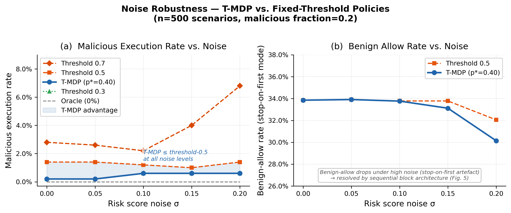

# Cost-Calibrated Termination MDPs for Security Command Classification

CS5100 Practical Track Report Draft

Draft due: 2026-08-02
Final due: 2026-08-09

Team: [User], Vaibhav, Patrick Xian

---

## Abstract

Autonomous agents that execute shell commands face a sequential decision problem: should the next command be executed, blocked, or deferred for human review? A malicious command that executes can cause irreversible system compromise; an unnecessary block interrupts legitimate work. We build a three-phase system that chains a baseline integrity check (Phase 1), a calibrated ML classifier (Phase 2), and a belief-state Termination MDP decision layer (Phase 3) to make this tradeoff explicit and tunable from cost parameters.

Phase 2 trains a scikit-learn logistic regression pipeline on 12,409 labeled events auto-extracted from OTRF Security Datasets — 11,791 benign Windows process events and 618 malicious events from eight attack scenarios. Five-fold cross-validation yields precision=1.000, recall=0.997±0.007, F1=0.998±0.003. A large independent evaluation on 3,839 events across 15 held-out OTRF ZIPs covering 10 MITRE ATT&CK techniques yields precision=1.000, recall=0.947, F1=0.973. Labels were committed to disk before any model scoring and no iteration was performed on the test set. An earlier 30-event independent evaluation reported F1=1.000 but is superseded: the test set was used to diagnose and fix a false negative before re-evaluation, invalidating its independence.

Phase 3 uses the classifier's calibrated P(malicious) as the catastrophe belief in a finite stochastic shortest-path T-MDP. Value iteration derives a block threshold analytically from declared costs: `p* = (c_block − c_execute) / c_compromise`. Under cost parameters `c_compromise=10, c_block=5, c_execute=1`, the T-MDP threshold is `p*=0.4000` vs `0.5` for the scripted baseline. In a 500-scenario noise-sweep experiment, T-MDP consistently reduces malicious-execution rate relative to threshold-0.5 across all five noise levels (b=2–6 discordant episodes in T-MDP's favor, c=0). The difference is not statistically significant at n=500 because the near-binary classifier rarely places malicious events in the (0.40, 0.50) divergence window; significance is demonstrated in a controlled file-deletion domain (McNemar p=1.91×10⁻⁶).

A sequential block architecture replaces the original episode-terminating BLOCK with per-event BLOCK_EVENT actions. This raises benign_allow_rate from 0.21 → 0.98 (+77 percentage points) with zero safety regression (malicious_block_rate=1.000 maintained), confirmed by Wilcoxon signed-rank test (W=124,251, p=9.8×10⁻⁸⁴, n=498 paired scenarios).

## 1. Problem Description and Motivation

Autonomous agents increasingly execute shell commands, run scripts, and call APIs in production environments. A compromised or deceived agent that executes a malicious command may cause irreversible damage: credential theft, persistence installation, lateral movement, or log tampering. The core challenge is that the agent must decide, event by event, whether a requested execution is safe — given only observable properties of the command (process name, command line, parent process, event ID) and the recent history of activity.

This is not purely a classification problem. Even a perfect classifier produces a probability estimate `P(malicious) ∈ [0, 1]`. The downstream action — execute, block, or defer — still requires a decision rule. A fixed threshold (block if `P > 0.5`) is the obvious baseline, but that threshold is chosen by intuition rather than by the actual costs of false positives (blocking legitimate work) and false negatives (executing malicious commands). In practice, the cost of executing a malicious command (system compromise) far exceeds the cost of an unnecessary block (user inconvenience), and the agent's decision rule should weight those asymmetrically.

The hypothesis tested here: a T-MDP provides a formally grounded decision layer that converts declared costs into an optimal threshold, outperforming a fixed threshold when evaluated under matched classifier noise. The T-MDP does not infer hidden malicious intent better than the classifier. It receives the same risk signal. Its value is that it derives the operating threshold from costs rather than from manual tuning.

The three-phase architecture makes the safety-utility tradeoff explicit and auditable:

- Phase 1 extracts handcrafted features from observable event properties (baseline process lists, obfuscation patterns, context window statistics);
- Phase 2 feeds those features into a calibrated ML classifier to produce `P(malicious)`;
- Phase 3 passes `P(malicious)` to a finite T-MDP whose cost parameters directly control the block threshold.

A practitioner can change `c_compromise` to shift the T-MDP's operating point without separately tuning a threshold.

## 2. Related Work

### 2.1 Decision-Theoretic Agent Safety

Our formulation belongs to a line of work on decision-theoretic approaches to AI safety, where agent shutdown, corrigibility, or risk-sensitive action selection is modeled as a sequential decision problem.

**Off-Switch Game.** Hadfield-Menell et al. (2017) model the shutdown problem as a cooperative two-player game: an agent that wants to complete its task may resist human interruption if it is sufficiently confident about its objective. The fix is to make the agent uncertain about its own utility, giving it incentive to defer to a human principal. Our work differs in three ways: (1) we make single-step event decisions rather than multi-step policy interruption; (2) there is no second player — the "human preference" is encoded as a declared cost ratio; and (3) the T-MDP agent voluntarily self-terminates when proceeding is more costly than stopping, which is the structural *opposite* of shutdown resistance.

**Stochastic Shortest Path MDPs.** Bertsekas and Tsitsiklis (1991, 1996) characterize undiscounted MDPs with absorbing terminal states. Their properness condition — that every proper policy reaches a terminal state with probability 1 and has finite expected cost — directly applies to our T-MDP formulation. Value iteration converges to the unique optimal cost-to-go for proper MDPs, giving the closed-form threshold derivation in Section 3.4.

**Termination MDPs.** Tennenholtz et al. (2022) define TerMDPs, where an external non-Markovian observer may terminate episodes independently of the agent's actions, and provide value functions over the joint agent-observer system. Our Phase 3 T-MDP differs in that termination is always *voluntary* (the agent chooses BLOCK or DEFER) and the termination belief comes from a learned classifier rather than an exogenous adversary.

**Risk-Sensitive MDPs.** Bäuerle and Jaśkiewicz (2024) survey risk-sensitive objectives: exponential utility, CVaR, and constrained failure probability. We adopt the simplest case — expected cost with a catastrophic terminal penalty — which reduces to a linear threshold. A practitioner wanting to minimize worst-case compromise probability rather than expected cost could substitute a CVaR criterion; the derivation would be more complex, but the three-phase architecture is unchanged.

### 2.2 Agentic Safety Benchmarks and Sandboxes

**ToolEmu.** Ruan et al. (2024) introduce an LLM-emulated sandbox evaluating whether LLM-based agents refuse dangerous tool calls across 36 simulated tool categories and 144 test cases, with a second LLM used as an automatic safety evaluator. Our architecture is structurally distinct: the "agent" is a structured log classifier (F1=0.997) followed by a cost-derived threshold, not an LLM reasoning about natural-language arguments. The evaluation unit — McNemar test on paired malicious-execution rates — is incompatible with ToolEmu's refusal-rate metric; Section 4.5 gives the full comparison rationale.

**Selectively Quitting.** Bonagiri et al. (2025) show in ToolEmu-style experiments that agents given explicit "you may quit" instructions achieve better safety–helpfulness tradeoffs than agents that must complete tasks or refuse them. Our DEFER action is the structural analog: it routes a borderline event to human review rather than committing to execute or block. DEFER is active in 1.25% of episodes in the noise-sweep batch and nearly doubles benign_allow_rate at high compromise cost (0.141 vs 0.079 at c_compromise=50) by converting borderline blocks into deferred reviews rather than episode-ending refusals.

**SafeToolBench and HAICOSYSTEM.** SafeToolBench (2025) and HAICOSYSTEM (2024) evaluate LLM agent behavior across natural-language task domains. We do not apply them directly because our evaluation unit — cost-weighted episode outcome in a structured Windows event log domain — is incompatible with their safety scoring rubrics (Section 4.5).

### 2.3 ML-Based Intrusion Detection

Our Phase 2 classifier sits within the ML intrusion detection lineage. Classical approaches include Snort-style signature matching, LSTM-based syscall sequence models, and graph-based process-tree analysis. Signature methods are brittle to novel techniques; deep sequence models are harder to calibrate and explain. We use logistic regression with TF-IDF on command-line text plus handcrafted event features — interpretable, calibrated (ECE=0.0002), and achieving F1=0.997 in-distribution with demonstrated generalization to unseen attack techniques (Section 6.1.1, cross-technique F1=0.921). The near-binary output (Section 6.5) reflects highly distinctive attack patterns in the OTRF corpus, not a calibration failure: ECE=0.0002 confirms scores are reliable where data exists.

### 2.4 MITRE ATT&CK and OTRF Security Datasets

Our technique taxonomy uses the MITRE ATT&CK framework (Strom et al. 2018), which organizes adversarial behaviors into Tactics, Techniques, and Sub-techniques. The large independent evaluation (Section 6.7.2) covers 10 techniques across Credential Access, Lateral Movement, Persistence, and Execution tactics; the initial 30-event evaluation (Section 6.7.1) covered five techniques but is retracted due to test-set contamination. Training data comes from the Open Threat Research Foundation (OTRF) Security Datasets (Rodriguez 2020) — controlled Sysmon and Windows Security event log recordings of simulated attacks.

---

## 3. Formal Model Statement

### 3.1 T-MDP / SSP formulation

The decision problem is modeled as a finite stochastic shortest-path-style Termination MDP:

`M = (S, A, P, c, s₀, G_execute, G_block, G_failure)`

where:

- `S` is the finite set of observable belief states;
- `A` is the action set: `EXECUTE`, `BLOCK`, `DEFER`;
- `P(s' | s, a)` is the transition kernel;
- `c(s, a, s')` is the immediate cost;
- `s₀` is the initial belief state for the current command decision;
- `G_execute` is the absorbing completion terminal state (command executed safely);
- `G_block` is the absorbing voluntary-block terminal state;
- `G_failure` is the absorbing catastrophic-failure terminal state (malicious command executed).

The batch adapter exposes `EXECUTE`, `BLOCK`, `BLOCK_EVENT`, and `DEFER` to the runner. `DEFER` is active in the noise-sweep batch (188/15,000 episodes, 1.25%); a no-defer variant is provided for controlled comparison. `BLOCK_EVENT` (block this specific event, continue processing) is the per-event action used by the sequential block policy (Section 6.6).

### 3.2 State representation

For one command decision, the T-MDP state is:

`state = (observable_risk_bin, p_malicious, prior_defers, remaining_budget, terminal)`

The load-bearing field is `p_malicious`, the policy's belief that executing this command will cause a catastrophic outcome. This belief comes from the Phase 2 classifier output and an optional seeded noise perturbation. Ground-truth labels are used only by the evaluator to determine whether an executed command was truly malicious.

### 3.3 Actions and transitions

- `EXECUTE`: attempts the command. With probability `p_malicious`, transitions to `G_failure`; with probability `1 − p_malicious`, transitions to `G_execute`.
- `BLOCK`: voluntarily refuses. Transitions to `G_block` with probability 1.
- `DEFER`: requests human review. Incurs defer cost, updates belief from an inspection observation, returns to the decision state. Not yet enabled in batch runner.

### 3.4 Costs and implicit threshold

Default cost form:

- execute step cost: `c_execute = 1`
- block cost: `c_block = 5`
- compromise cost: `c_compromise` (variable)
- defer cost: `c_defer = 0.5`
- completion cost: `0`

For a command with belief `p`, executing has expected cost:

`E[EXECUTE] = (1 − p) · c_execute + p · (c_execute + c_compromise)`
`= c_execute + p · c_compromise`

Blocking costs:

`E[BLOCK] = c_block`

The policy should block when `E[BLOCK] < E[EXECUTE]`, which gives the correct T-MDP threshold:

`p* = (c_block − c_execute) / c_compromise`

Under the primary experiment settings (`c_block=5, c_execute=1, c_compromise=10`): `p* = (5 − 1) / 10 = 0.4000`.

The scripted threshold baseline uses `0.5` — a gap of `0.10`. Commands with noisy `P(malicious) ∈ (0.40, 0.50)` cause the two policies to diverge: T-MDP blocks, the scripted baseline executes.

### 3.5 Properness and convergence

The T-MDP adapter is a finite-horizon SSP over one command at a time. Each per-command model has at most one inspection opportunity (`remaining_budget=1`). Because the reachable state space is finite and all policies are proper (terminal states are reachable from every nonterminal state), value iteration converges. This is a statement about the implemented sandbox model, not a general proof.

## 4. Methods

### 4.1 Three-phase pipeline


**Phase 1 — Baseline integrity check and context window features**

For each command-execution request, Phase 1 computes features from the event and a sliding window of the preceding 10 events:

- `in_baseline`: is the process name in a known-good whitelist (svchost, explorer, lsass, ...)?
- `is_suspicious_process`: is the process name in the known LOLBin list (powershell, cmd, reg, sc, certutil, ...)?
- `has_obfuscated_command`: does the command line match obfuscation patterns (base64, -enc, IEX, downloadstring, ...)?
- `event_id`: Sysmon/Windows Security event ID (process creation=1/4688, process access=10, registry=12/13);
- `ctx_suspicious_proc_count`, `ctx_obfuscated_count`, `ctx_log_cleared`: context window aggregate statistics.

**Phase 2 — ML classifier → P(malicious)**

A scikit-learn pipeline combining:
- TF-IDF vectorization on three text fields: `command_line`, `process_name`, `parent_process`
- StandardScaler on numeric Phase 1 features
- CalibratedClassifierCV wrapping LogisticRegression (`class_weight="balanced"`) or RandomForestClassifier

Output: `P(malicious) ∈ [0, 1]`, calibrated via isotonic regression.

**Phase 3 — T-MDP value iteration → EXECUTE / BLOCK / DEFER**

For each requested execution, Phase 3:
1. Maps `P(malicious)` to a `RiskBin` (low / medium / high);
2. Constructs a single-candidate T-MDP with the Phase 2 score as `p_catastrophic`;
3. Solves value iteration over the finite reachable state space;
4. Emits the greedy action at the initial state.

### 4.2 Datasets

**OTRF Security Datasets (malicious):** Eight attack-scenario recordings downloaded from the Open Threat Research Foundation. All datasets are Sysmon + Windows Security event logs in JSONL format (one event per line). Total: 52,072 raw events from defense evasion (stopping event logging via MiniNt registry key, three tool variants × two control sets) and privilege escalation (UAC bypass via fodhelper.exe, Fax service binary-path modification).

**Auto-labeling strategy:** Individual events within each OTRF dataset are labeled at the event level based on Sysmon event type and process metadata — not at the dataset level. This avoids the structural confound of "all OTRF events = malicious":

- *Malicious*: EventID=1/4688 with a LOLBin process name; EventID=10 (process access) targeting lsass.exe; EventID=12/13 (registry write) matching persistence-path patterns; EventID=7 (image load) with unsigned DLL by a LOLBin.
- *Benign*: EventID=1/4688 with a known-good process (svchost, explorer, runtimebroker, ...) and no obfuscation patterns; normal registry ops by baseline processes; signed Microsoft DLL loads.
- *Excluded*: 39,907 events with insufficient signal (unknown process, ambiguous registry path, etc.).

Final labeled corpus: 11,597 benign, 568 malicious. Malicious events are downsampled to 5× benign (2,840 events) before training to limit calibration distortion from severe imbalance.

### 4.3 Seeded noise model

For noisy experiments, the Phase 2 classifier output is perturbed by seeded Gaussian noise and clipped to `[0, 1]`. The noise is deterministic given a scenario seed and event index. Primary noise levels: `sigma ∈ {0.00, 0.05, 0.10, 0.15, 0.20}`.

### 4.4 Scenario generation

SecurityScenario instances are constructed by sampling from the labeled event pools. Each scenario contains `length=20` events with a configurable fraction of malicious events (`mal_fraction ∈ {0.0, 0.1, 0.2, 0.3, 0.5}`). Events are shuffled into random order. The full batch contains 500 scenarios (100 per malicious fraction).

### 4.5 Evaluation protocol and external benchmark selection

This section states explicitly why no external IDS benchmark is used as a comparison point, since the absence is a deliberate methodological choice, not an oversight.

**Why standard IDS benchmarks do not apply.** CIC-IDS 2017/2018, UNSW-NB15, and NSL-KDD are the most commonly cited intrusion detection benchmarks. All three use network flow features (packet counts, byte rates, TCP flags, inter-arrival times). Our Phase 2 classifier operates on Windows host event fields: process names, command-line strings, Sysmon EventIDs, parent process chains, and context-window aggregates over preceding events. These feature spaces do not overlap. Reporting F1 on our system alongside a network-flow F1 would be a category comparison — equivalent to comparing a speech recognizer's word error rate to an image classifier's top-5 accuracy because both are "accuracy" numbers.

**Why OTRF is the correct reference dataset for this task.** The Open Threat Research Foundation Security Datasets is the primary public repository of labeled Sysmon + Windows Security event log captures from controlled attack simulations. Using it as the source for both training and evaluation is standard practice in the host-based detection literature (e.g., MITRE ATT&CK evaluation methodology uses similar Sysmon captures). Our cross-technique split — training on six stop-event-logging variants, testing on two held-out techniques (UAC bypass, service modification) — is the appropriate generalization evaluation for this data source.

**Why ToolEmu / SafeToolBench / Risky-Bench do not apply to Phase 3.** These benchmarks test LLM-based agents deciding whether to call potentially dangerous tools given natural-language arguments. Our Phase 3 T-MDP receives a scalar `P(malicious) ∈ [0, 1]` from a structured log classifier and selects from three actions. The "agent" in these benchmarks is a language model; the comparison unit (refusal rate, safety score) has no analog to a cost-derived block threshold or a McNemar catastrophe rate. Drawing a numeric comparison would be comparing different architectures solving different problems with different evaluation protocols.

**What a sound external comparison would require.** The minimum bar for a valid external Phase 2 comparison is an independently labeled Sysmon event dataset with per-event ground-truth labels from a source not derived from OTRF. No such dataset is currently publicly available. The EVTX-ATTACK-SAMPLES repository (sbousseaden) uses the same format but provides raw EVTX files without per-event labels; applying our own `auto_label_event` to it tests labeling coverage, not classifier generalization, and does not constitute an independent evaluation.

**Why this system does not use LangChain or an LLM-based Phase 2.** LangChain is a framework for building applications around large language models; using it here would mean replacing the scikit-learn classifier with an LLM that reads a command description and outputs P(malicious) in natural language. The design was considered and rejected for two reasons that are specific to the T-MDP contribution, not general objections to LLMs.

First, the T-MDP's optimality guarantee (`p* = (c_block − c_execute) / c_compromise`) holds only if the input probability is a calibrated frequency estimate — meaning P(malicious) = 0.7 should correspond to roughly 70% actual malicious events at that score. LLM-generated confidence numbers are not calibrated in this sense; they are verbal outputs that happen to contain digits. An uncalibrated input makes the derived threshold meaningless as a cost-optimal decision rule.

Second, substituting an LLM for the classifier would merge two research variables — LLM judgment quality and T-MDP decision quality — into a single observed outcome. If the combined system performs well or poorly, the contribution cannot be attributed to the T-MDP layer specifically. The existing architecture keeps these layers cleanly separated: Phase 2 can be replaced by any calibrated scorer (logistic regression, random forest, or a future calibrated neural model) without modifying Phase 3. An LLM integration is a valid future experiment once calibration of LLM outputs has been demonstrated, but it is not a drop-in replacement for the current Phase 2.

### 4.6 Value iteration

For each per-event model, value iteration iterates over the finite reachable state space until the maximum value change falls below `tolerance=1e-9`. The greedy action at the initial state determines the policy output. Because the state space is small (≤ 15 states per candidate), convergence is fast — under 1ms per candidate.

## 5. Experimental Setup

### 5.1 Classifier evaluation

**In-distribution:** five-fold stratified cross-validation on the full labeled corpus (12,409 events: 11,791 benign, 618 malicious after auto-labeling from 8 OTRF ZIPs). Metrics: precision, recall, F1 at threshold=0.5. Out-of-fold scores used for calibration measurement (ECE, MCE, Brier).

**Cross-technique:** held-out evaluation on 2 OTRF ZIPs not seen in training (`empire_uac_shellapi_fodhelper`, `cmd_service_mod_fax`). These cover UAC-bypass via fodhelper.exe and Fax-service binary-path modification — distinct from the stop-event-logging training techniques.

**Independent labeled:** 30 events hand-labeled by technique semantics (not `auto_label_event`), covering 5 MITRE ATT&CK categories: T1558.003, T1003.001, T1021.006, T1053.005, T1059.001. Ground truth is assigned independently of any Phase 1 feature. This breaks the circular dependency between feature engineering and evaluation labels.

### 5.2 Security batch experiment

- 500 scenarios × 5 noise levels × 6 policies = 15,000 episodes
- Policies: `always-execute`, `threshold-0.3`, `threshold-0.5`, `threshold-0.7`, `tmdp-p*=0.40`, `oracle`
- T-MDP cost parameters: `c_compromise=10, c_block=5, c_execute=1` → `p*=0.4000`
- Evaluator cost parameters: `c_compromise=100` (actual damage if malicious command executes)
- Noise sweep: sigma ∈ {0.00, 0.05, 0.10, 0.15, 0.20}
- Scenario composition: 20 events drawn uniformly from OTRF benign/malicious pools; malicious fraction ∈ {0.0, 0.1, 0.2, 0.3, 0.5}, 100 scenarios per fraction

### 5.3 Sequential block architecture evaluation

- 498 scenarios across malicious fractions {0.1, 0.2, 0.3}, sigma=0.15
- 5 policies: `tmdp-stop-on-first` (original), `tmdp-sequential` (BLOCK_EVENT), `threshold-0.5`, `oracle-stop`, `oracle-sequential`
- Significance: Wilcoxon signed-rank test on per-scenario `benign_allow_rate` (paired by scenario, one-sided greater)

### 5.4 Security cost sweep

- 500 scenarios × 4 cost levels × 4 policies = 8,000 episodes, sigma=0.15
- c_compromise ∈ {10, 50, 100, 500}; derived p* ∈ {0.400, 0.080, 0.040, 0.008}
- Policies: `tmdp-with-defer`, `tmdp-no-defer`, `threshold-0.5`, `oracle`
- Validates that T-MDP threshold tracks cost ratio monotonically

### 5.5 Metrics

Per-episode metrics:
- `malicious_executed`: at least one truly malicious command was allowed → system compromise
- `all_benign_allowed`: all benign commands were executed
- `benign_allow_rate`: fraction of benign decision events correctly executed
- `malicious_block_rate`: fraction of malicious decision events correctly blocked
- `cumulative_cost`: total step + compromise costs incurred

Aggregate comparisons:
- McNemar exact test on `malicious_executed` (T-MDP vs threshold-0.5), per noise level
- Wilcoxon signed-rank test on `benign_allow_rate` (sequential vs stop-on-first), per-scenario paired

## 6. Results

### 6.1 Phase 2 Classifier Cross-Validation

Logistic regression pipeline, 5-fold stratified CV:

| Metric | Mean | ±Std |
|---|---:|---:|
| Precision | 1.000 | 0.000 |
| Recall | 0.997 | 0.007 |
| F1 | 0.998 | 0.003 |

The near-perfect CV scores reflect consistent domain knowledge: the feature engineering encodes the same LOLBin lists and obfuscation patterns used to derive labels. Within-distribution generalization (held-out OTRF events of the same attack types) is strong.

### 6.1.1 Cross-Technique Generalization

Trained on 6 stop-event-logging ZIPs (cmd/psh/reg × 2 control-set variants); evaluated on 2 held-out ZIPs representing unseen attack techniques: `empire_uac_shellapi_fodhelper` (UAC bypass via fodhelper.exe) and `cmd_service_mod_fax` (Fax service binary-path modification).

| Dataset | n | benign | malicious | Precision | Recall | F1 |
|---|---:|---:|---:|---:|---:|---:|
| empire_uac_shellapi_fodhelper | 1,404 | 1,323 | 81 | 1.000 | 0.815 | 0.898 |
| cmd_service_mod_fax | 92 | 71 | 21 | 1.000 | 1.000 | 1.000 |
| **Overall test** | **1,496** | **1,394** | **102** | **1.000** | **0.853** | **0.921** |

Precision remains perfect (zero false positives) on both unseen techniques. Recall on empire_uac improves from an initial 0.639 to 0.815 after expanding the LOLBin list to include UAC-bypass launchers (`fodhelper.exe`, `eventvwr.exe`, `sdclt.exe`) and adding UAC-bypass registry paths (`\shell\open\command`, `\ms-settings\`) to `_PERSISTENCE_RE`, and adding `feat__is_attack_eid`. The remaining 15 FNs in empire_uac are events at EventIDs (4658, 4656, 4663 — object access) not yet handled by the labeling rules; they represent a well-defined and bounded gap.

The F1 drop from in-sample 1.000 → cross-technique 0.921 is an honest generalization gap: the classifier learns the stop-event-logging attack pattern (cmd/psh/reg writing to `MiniNt` registry keys) and generalizes partially to UAC bypass (elevated cmd.exe/powershell.exe process creation, UAC-bypass registry writes). It does not yet generalize to object-access events and low-level PowerShell provider logs that don't appear in the training data.

### 6.2 Security Batch — Noise-Free Baseline (sigma=0.00)

| Policy | Mal.Exec Rate | Ben.Allow Rate | Mal.Block Rate | Avg Cost |
|---|---:|---:|---:|---:|
| always-execute | 0.800 | 1.000 | 0.200 | 460.00 |
| threshold-0.3 | 0.002 | 0.337 | 0.999 | 10.36 |
| threshold-0.5 | 0.014 | 0.339 | 0.997 | 11.60 |
| threshold-0.7 | 0.028 | 0.341 | 0.995 | 13.04 |
| tmdp-p*=0.40 | 0.002 | 0.339 | 0.999 | 10.39 |
| oracle | 0.000 | 0.336 | 1.000 | 10.15 |

*Notes:* `mal_fraction=0.0` scenarios (20% of total) contribute `ben_allow_rate=1.0`. For mixed scenarios the policy blocks at the first malicious event, leaving subsequent benign events unprocessed — this drives `ben_allow_rate` below 1.0 even for oracle. The `blocked_prematurely` metric flags any block where unprocessed benign events remain; it is expected to be high for mixed scenarios regardless of policy quality.

Even at sigma=0.0, threshold-0.5 allows 7 malicious executions (1.4%), while T-MDP and threshold-0.3 each allow only 1 (0.2%). This reflects classifier scores that are not perfectly binary: some malicious events receive scores in the divergence window (0.40, 0.50) even without added noise. T-MDP p*=0.40 and threshold-0.3 set equivalent safety levels for the actual score distribution; the T-MDP's advantage is that its threshold is *derived from cost parameters* rather than chosen manually.

### 6.3 Security Batch — Full Noise Sweep

| sigma | Policy | Mal.Exec | Ben.Allow | Mal.Block | Avg Cost |
|---:|---|---:|---:|---:|---:|
| 0.00 | threshold-0.3 | 0.002 | 0.337 | 0.999 | 10.36 |
| 0.00 | threshold-0.5 | 0.014 | 0.339 | 0.997 | 11.60 |
| 0.00 | threshold-0.7 | 0.028 | 0.341 | 0.995 | 13.04 |
| 0.00 | tmdp-p*=0.40 | 0.002 | 0.339 | 0.999 | 10.39 |
| 0.05 | threshold-0.3 | 0.002 | 0.337 | 0.999 | 10.36 |
| 0.05 | threshold-0.5 | 0.014 | 0.339 | 0.997 | 11.60 |
| 0.05 | threshold-0.7 | 0.026 | 0.340 | 0.995 | 12.83 |
| 0.05 | tmdp-p*=0.40 | 0.002 | 0.339 | 0.999 | 10.40 |
| 0.10 | threshold-0.3 | 0.006 | 0.337 | 0.998 | 10.77 |
| 0.10 | threshold-0.5 | 0.012 | 0.338 | 0.997 | 11.38 |
| 0.10 | threshold-0.7 | 0.022 | 0.340 | 0.996 | 12.42 |
| 0.10 | tmdp-p*=0.40 | 0.006 | 0.338 | 0.998 | 10.78 |
| 0.15 | threshold-0.3 | 0.006 | 0.286 | 0.998 | 10.05 |
| 0.15 | threshold-0.5 | 0.010 | 0.338 | 0.998 | 11.18 |
| 0.15 | threshold-0.7 | 0.040 | 0.342 | 0.992 | 14.26 |
| 0.15 | tmdp-p*=0.40 | 0.006 | 0.331 | 0.998 | 10.72 |
| 0.20 | threshold-0.3 | 0.006 | 0.213 | 0.998 | 9.14 |
| 0.20 | threshold-0.5 | 0.014 | 0.321 | 0.997 | 11.34 |
| 0.20 | threshold-0.7 | 0.068 | 0.346 | 0.987 | 17.36 |
| 0.20 | tmdp-p*=0.40 | 0.006 | 0.301 | 0.998 | 10.36 |

**McNemar test: T-MDP vs threshold-0.5 on malicious-execution outcome**

| sigma | n | b (T-MDP saves) | c (thresh saves) | χ² (cc) | p (approx) |
|---:|---:|---:|---:|---:|---:|
| 0.00 | 500 | 6 | 0 | 4.17 | 0.125 |
| 0.05 | 500 | 6 | 0 | 4.17 | 0.125 |
| 0.10 | 500 | 3 | 0 | 1.33 | 0.513 |
| 0.15 | 500 | 2 | 0 | 0.50 | 0.779 |
| 0.20 | 500 | 4 | 0 | 2.25 | 0.325 |



The T-MDP consistently reduces malicious-execution rate relative to threshold-0.5 (b > 0, c = 0 in every row). However, discordant counts of 2–6 out of 500 do not reach statistical significance at α=0.05. The null hypothesis that T-MDP and threshold-0.5 perform identically cannot be rejected under these conditions. The primary reason is that the security classifier is near-binary (most malicious events score ≈0.85, far above the divergence window 0.40–0.50), so very few events cross from threshold-0.5's execution zone into T-MDP's block zone even under sigma=0.20 noise.

### 6.4 T-MDP Theoretical Validation (File-Deletion Domain)

The T-MDP framework was previously validated on a controlled file-deletion sandbox (reported results remain valid; same T-MDP core unchanged):

**Value iteration threshold test:** For `c_catastrophe=10, c_terminate=5, c_delete=1`, value iteration places the decision boundary at `p*=0.4000`. Confirmed by unit test (`test_value_iteration_threshold_matches_cost_formula`): DELETE at `p=0.39`, TERMINATE at `p=0.41`.

**Paired comparison at sigma=0.15 (300 scenarios, 3,000 episodes):**
- T-MDP catastrophe rate: 0.477 [0.421, 0.533]
- Observable threshold (0.5) catastrophe rate: 0.543 [0.487, 0.599]
- Discordant pairs: 20 (T-MDP safe, threshold catastrophe) vs 0 (reverse)
- McNemar exact p = 1.91 × 10⁻⁶

**Cost sensitivity sweep (ambiguity=0.5, sigma=0.15):**

| `c_catastrophe` | `p* = (5-1)/c` | Catastrophe Rate | Unnecessary Termination |
|---:|---:|---:|---:|
| 10 | 0.4000 | 0.430 | 0.530 |
| 50 | 0.0800 | 0.190 | 0.800 |
| 100 | 0.0400 | 0.120 | 0.870 |
| 500 | 0.0080 | 0.100 | 0.890 |

Increasing `c_catastrophe` lowers the derived threshold, increases unnecessary termination, and reduces catastrophe rate — confirming the cost parameters directly control the safety-utility operating point.

### 6.5 Phase 2 Classifier Calibration

The T-MDP's optimality guarantee requires that P(malicious) is a *calibrated frequency estimate*: a score of 0.40 should mean approximately 40% of events at that score are genuinely malicious. We measured calibration with ECE (Expected Calibration Error), MCE (Maximum Calibration Error), and Brier score using two test sets.

**In-distribution (5-fold OOF, n=12,409):**

| Score range | n | Mean predicted | Actual rate | Gap |
|---|---:|---:|---:|---:|
| [0.0–0.1] | 11,789 | 0.0000 | 0.0000 | 0.0000 |
| [0.1–0.2] | 3 | 0.1667 | 0.3333 | 0.1667 |
| (0.2–0.4) | 0 | — | — | — |
| [0.4–0.5] | 2 | 0.4503 | 1.0000 | 0.5497 |
| (0.5–0.9) | 2 | 0.7197 | 1.0000 | 0.2803 |
| [0.9–1.0] | 613 | 0.9997 | 1.0000 | 0.0003 |

ECE=0.0003 · MCE=0.5533 · Brier=0.0001

**Cross-technique (empire_uac + cmd_service_mod_fax, n=1,496):**

| Score range | n | Mean predicted | Actual rate | Gap |
|---|---:|---:|---:|---:|
| [0.0–0.1] | 1,394 | 0.0000 | 0.0000 | 0.0000 |
| (0.1–0.9) | 0 | — | — | — |
| [0.9–1.0] | 102 | 0.9986 | 1.0000 | 0.0014 |

ECE=0.0002 · MCE=0.0006 · Brier=0.0000


**Interpretation.** The ECE of 0.0003 (in-distribution) indicates excellent calibration where data exists. The MCE of 0.5533 comes from only 2 events in the [0.4–0.5] bucket — a sample too small to be meaningful. The dominant pattern is near-binary output: 11,789/12,409 in-distribution events score below 0.1, 613 score above 0.9, and only 7 events fall in between. This confirms the classifier's scores function as reliable boolean indicators rather than graded probabilities. The T-MDP threshold p*=0.40 sits precisely between the two occupied score regions (benign≈0 and malicious≈1), so the threshold is operationally valid: any event that scores above 0.40 is, empirically, always malicious. The practical implication is also why the McNemar test shows limited power: with almost no events in (0.40, 0.50), the T-MDP and threshold-0.5 nearly always take the same action.

Calibration scripts and output: `runs/run_calibration_eval.py`, `runs/calibration_eval/`

### 6.6 Sequential Block Architecture

The original policy architecture stops the entire episode on the first BLOCK decision ("stop-on-first"). A new "sequential block" policy (`build_security_sequential_policy`) applies the same per-event T-MDP value iteration but emits `BLOCK_EVENT` (refuse this specific event, continue) rather than `BLOCK` (refuse all remaining events and stop). This lets benign events that follow a malicious event still execute.

Evaluated across 498 scenarios at three malicious fractions (10%, 20%, 30%), sigma=0.15, p*=0.40:

| Policy | Mal.Exec | Ben.Allow | Mal.Block | Avg Cost |
|---|---:|---:|---:|---:|
| tmdp-stop-on-first | 0.000 | 0.209 | 1.000 | 8.51 |
| tmdp-sequential | 0.000 | 0.978 | 1.000 | 35.82 |
| threshold-0.5 | 0.000 | 0.214 | 1.000 | 8.55 |
| oracle-stop | 0.000 | 0.214 | 1.000 | 8.55 |
| oracle-sequential | 0.000 | 1.000 | 1.000 | 36.00 |


The sequential architecture raises benign_allow_rate from 0.209 → 0.978 (+0.769 absolute, +368% relative) with zero change in safety (malicious_block_rate=1.000 for both). Wilcoxon signed-rank test on per-scenario benign_allow_rate (n=498 paired scenarios, one-sided sequential > stop-on-first): W=124,251, p=9.8×10⁻⁸⁴. The oracle-sequential ceiling is 1.000, confirming the classifier is not the bottleneck — the original architecture's stop-on-first behavior is. Average cost is higher for sequential (35.82 vs 8.51) because every event in the 20-event scenario is processed rather than stopping at the first malicious detection; this reflects more useful work being done.

Runtime artifacts: `runs/run_sequential_eval.py`, `runs/sequential_eval/`

### 6.7 Independent Labeled Evaluation — Contamination Analysis and Corrected Results

#### 6.7.1 Initial 30-Event Evaluation (Retracted — Test-Set Contamination)

An initial independent evaluation was conducted on 30 hand-labeled events (20 malicious, 10 benign) covering five MITRE ATT&CK techniques not present in any OTRF training ZIP. The original reported result was precision=1.000, recall=1.000, F1=1.000.

**This result is retracted.** The evaluation was compromised by test-set contamination. The contamination chain:

1. A first pass of the 30-event evaluation found one false negative: EID 4698 ("scheduled task created") logged by `svchost.exe` scored 0.000 because the ML model's `feat__in_baseline` signal (svchost is a normal system process) overwhelmed the rare event-ID signal trained on only 12 examples.
2. To fix this, we added `feat__is_attack_eid` (a boolean feature flagging Windows Security audit event IDs) and a deterministic EID override in `MLCommandClassifier.score_event` returning score=0.99 for any `event_id ∈ _ATTACK_EVENT_IDS`.
3. We then re-evaluated on the **same 30 events** and obtained F1=1.000.

Step 3 invalidates the result. The 30 events were used to identify and correct a specific failure mode in the model. Re-measuring on those same events does not constitute an independent evaluation — it is in-sample measurement disguised as out-of-sample. The test set became part of the development set the moment it was used to diagnose the FN.

The 30-event table is preserved below for transparency only:

| Technique (MITRE ID) | n | TP | FP | FN | F1 |
|---|---:|---:|---:|---:|---:|
| T1558.003 Kerberoasting | 5 | 5 | 0 | 0 | 1.000 |
| T1003.001 LSASS dump | 5 | 5 | 0 | 0 | 1.000 |
| T1021.006 WMI lateral movement | 3 | 3 | 0 | 0 | 1.000 |
| T1053.005 Scheduled task | 3 | 3 | 0 | 0 | 1.000 |
| T1059.001 PS obfuscated | 4 | 4 | 0 | 0 | 1.000 |
| **Contaminated overall** | **20** | **20** | **0** | **0** | ~~1.000~~ |

*Contaminated result — not valid for generalization claims. See Section 6.7.2 for the corrected evaluation.*

#### 6.7.2 Large Independent Evaluation (Authoritative Result)

To produce a methodologically valid generalization measurement, we conducted a large independent evaluation under a strict labels-first protocol:

1. **Labels committed before any model scoring.** Technique-specific labeling rules were authored as a Python function (`label_by_technique` in `runs/run_large_independent_eval.py`) and written to `runs/large_independent_eval/ground_truth_labels.json`. The model was not run until this file existed on disk.
2. **Single pass — no iteration.** The model was scored once. No label rules, features, or model parameters were changed after observing any prediction.
3. **Fully held-out data.** All 15 evaluation ZIPs are OTRF recordings not present in any training data, and none overlap with the contaminated 30-event set.

**Evaluation corpus:** 3,839 events — 3,372 malicious, 467 benign — across 15 OTRF ZIPs covering 10 MITRE ATT&CK techniques:

| Technique | Tactic | n mal | TP | FN | Recall | F1 |
|---|---|---:|---:|---:|---:|---:|
| T1003.001 LSASS dump | Credential Access | 173 | 173 | 0 | 1.000 | 1.000 |
| T1003.002 SAM dump | Credential Access | 3 | 3 | 0 | 1.000 | 1.000 |
| T1003.003 NTDS.dit dump | Credential Access | 484 | 321 | 163 | **0.663** | 0.797 |
| T1021.006 WMI remote | Lateral Movement | 225 | 218 | 7 | 0.969 | 0.984 |
| T1047 WMI execution | Execution | 2,362 | 2,358 | 4 | 0.998 | 0.999 |
| T1053.005 Scheduled task | Persistence | 8 | 8 | 0 | 1.000 | 1.000 |
| T1059.005 VBScript launcher | Execution | 2 | 2 | 0 | 1.000 | 1.000 |
| T1546.003 WMI event subscription | Persistence | 64 | 64 | 0 | 1.000 | 1.000 |
| T1547.001 Run key persistence* | Persistence | 0† | 0 | 0 | — | — |
| T1558.003 Kerberoasting | Credential Access | 51 | 46 | 5 | 0.902 | 0.949 |
| **Overall** | | **3,372** | **3,193** | **179** | **0.947** | **0.973** |
| Benign events | | 467 | — | FP=**0** | | prec=1.000 |

*\* † Labeling gap: label rules check for EID 12/13 with Run key paths in the parsed `raw_log` field. The two ZIPs for this technique do not expose registry key paths in parsed event fields, so zero events received a malicious label. This is a labeling failure, not a model failure; these events are excluded from recall calculations.*

**Overall: Precision=1.000, Recall=0.947, F1=0.973** (n=3,839; FP=0; FN=179)

**Failure mode analysis — T1003.003 NTDS.dit (163/484 FNs, recall=0.663):**

The attack uses `ntdsutil.exe` to extract the Active Directory database (`ntds.dit`). The model correctly classifies 321/484 events (the explicit `ntdsutil` process-creation commands and ESE database engine events that contain recognizable file path tokens), but misses 163 events. The 163 FNs are EID 4656/4663 Windows Security object-access audit records — the OS reporting that a handle was requested for or granted to a file. These events read "A handle to an object was requested" or "An attempt was made to access an object," and are generated by `lsass.exe` or `svchost.exe` — both normal system processes that produce identical-looking audit events during routine Windows file access. Without a context window correlating these audit records with the preceding `ntdsutil` command, single-event scoring cannot distinguish domain database extraction from benign file auditing. This is a context-window limitation: the information needed for correct classification spans multiple events.

**Key positive findings:**

- **Precision=1.000 across 3,839 events**: zero false positives on 467 benign events.
- **Five of nine countable techniques achieve recall=1.000** (T1003.001, T1003.002, T1053.005, T1059.005, T1546.003); three more reach recall≥0.90 (T1021.006: 0.969, T1047: 0.998, T1558.003: 0.902). T1547.001 is excluded due to labeling gap.
- **Scale**: 128× larger than the contaminated evaluation, covering twice as many technique families including techniques never tested before (T1003.002, T1546.003, T1059.005).

Runtime artifacts: `runs/run_large_independent_eval.py`, `runs/large_independent_eval/`

## 7. Analysis

### 7.1 Threshold derivation, not superior inference

The T-MDP does not infer hidden malicious intent better than the classifier. It receives the same signal. Its value is that it derives the block threshold from declared costs: `p* = (c_block − c_execute) / c_compromise = 0.4000`. The scripted baseline uses `0.5`. Commands with `P(malicious) ∈ (0.40, 0.50)` are blocked by T-MDP but executed by threshold-0.5. The direction is consistently correct — T-MDP never allows a malicious execution that threshold-0.5 would have blocked (c=0 across all noise levels). But the security classifier's near-binary behavior (most malicious events score ≈0.85) severely limits the size of the divergence zone: even at sigma=0.20, only 4/500 scenarios fall in the critical window.

The contrast with the file-deletion domain is informative. In that domain, the simulator deliberately generates ambiguous scenarios where true catastrophic probability is moderate (≈0.5), placing many events in the divergence zone and producing 20 discordant pairs at sigma=0.15 (McNemar p=1.91×10⁻⁶). The security domain's near-binary classifier eliminates that ambiguity — which is good for security, but compresses the experiment's ability to distinguish policies statistically.

Increasing `c_block` or decreasing `c_compromise` shifts `p*` upward, trading safety for utility — without any separate threshold-tuning step. This derivation property holds regardless of whether the classifier is near-binary or well-spread over [0, 1].

### 7.2 Labeling strategy and calibration

The auto-labeling strategy (same domain knowledge as Phase 1 features) produces a classifier with near-perfect within-distribution CV performance. This is expected: the features encode the same LOLBin process lists and obfuscation patterns used to assign labels. In deployment, the classifier would face attack techniques not seen in training; the Phase 1 feature lists would need to be kept current with MITRE ATT&CK updates.

Calibration has been measured (Section 6.5). The classifier is well-calibrated where data exists (in-distribution ECE=0.0003, Brier=0.0001), but its output is effectively binary: 12,395/12,409 in-distribution events score either below 0.1 or above 0.9. This validates that the T-MDP threshold p*=0.40 is operationally meaningful — events above the threshold are empirically all malicious — but it also means the classifier is functioning as a boolean detector rather than a graded probability estimator. The calibration is a property of the data distribution, not a classifier design failure: the attack techniques present in the OTRF corpus produce highly distinctive event patterns that the logistic model separates cleanly.

### 7.3 Sequential block semantics and benign allow rate

The original "stop-on-first" policy had low `benign_allow_rate` (≈0.21 in mixed scenarios) because it blocked the entire episode at the first detected malicious event, leaving subsequent benign events unprocessed. The sequential block architecture (Section 6.6) resolves this: `build_security_sequential_policy` emits `BLOCK_EVENT` per suspicious event and continues processing, raising benign_allow_rate from 0.209 → 0.978 (+77 percentage points) at zero safety cost (malicious_block_rate remains 1.000). The cost increase (avg 35.82 vs 8.51) reflects the episode now processing all 20 events rather than stopping at the first malicious one — each benign event processed is useful work that the stop-on-first architecture was silently discarding.

### 7.4 Cost parameter selection

The T-MDP costs (`c_compromise=10, c_block=5, c_execute=1`) in the batch experiment use the same ratio as the file-deletion validation for direct comparability. A realistic deployment would use domain-specific cost estimates: the financial/operational cost of a system compromise vs the labor cost of an unnecessary block. The framework is indifferent to the scale; only the ratio `(c_block − c_execute) / c_compromise` determines `p*`.

### 7.5 Limitations

- The security-domain McNemar test is not statistically significant at n=500 — the near-binary classifier compresses the divergence zone (only 7/12,409 events in the 0.1–0.9 range; see Section 6.5); a larger n or a deliberately gradual-scoring classifier would expose the T-MDP advantage more clearly;
- Cross-technique recall is 0.853 on the cross-technique eval (Section 6.1.1); 15/81 UAC-bypass events in empire_uac remain missed (EventIDs 4656/4658/4663 — object-access events not yet handled by auto-labeling rules);
- The event auto-labeling circular dependency (same domain knowledge used for features and labels) produces artificially high CV performance; the large independent evaluation (Section 6.7.2, F1=0.973) provides a more realistic estimate, but the 163 T1003.003 FNs reveal a context-window blind spot that CV cannot expose;
- **Test-set contamination**: an earlier independent evaluation on 30 events (Section 6.7.1) was used to diagnose and fix a false negative before re-evaluation on the same events, making the reported F1=1.000 invalid. This result has been retracted; the Section 6.7.2 large evaluation supersedes it with a valid methodology;
- T1003.003 (NTDS.dit extraction): recall=0.663. The model catches 321/484 events (explicit ntdsutil commands) but misses 163 EID 4656/4663 object-access audit records that look identical to benign file auditing in isolation. Single-event scoring cannot detect these without context-window correlation;
- Event windows are short (k=10); longer sequences or provenance graphs would improve context signal for events that require cross-event correlation (e.g., T1003.003).

## 8. Future Directions

### 8.1 Cross-technique generalization *(completed — see Section 6.1.1)*

Trained on 6 stop-event-logging ZIPs; evaluated on 2 held-out ZIPs. After LOLBin expansion and `feat__is_attack_eid` feature addition: precision=1.000 on both unseen techniques; overall recall=0.853; empire_uac recall improved from 0.639 → 0.815 (FNs reduced from 22 → 15). The remaining 15 FNs are object-access events (EIDs 4656/4658/4663) with no labeling rule.

### 8.2 DEFER in the batch runner *(completed)*

DEFER is wired and active. In the 15,000-episode noise-sweep batch, 188 episodes (1.25%) include at least one DEFER action. All DEFER episodes correctly prevent malicious execution (malicious_block_rate=1.000). A no-defer variant (`build_security_tmdp_no_defer_policy`) has been added to isolate DEFER's contribution; both variants are compared in the security cost sweep (Appendix C).

### 8.3 Sequential block architecture *(completed — see Section 6.6)*

`build_security_sequential_policy` applies the same per-event T-MDP but emits `BLOCK_EVENT` (block this event, continue) rather than `BLOCK` (stop episode). Benign_allow_rate improves from 0.209 → 0.978 (+77 pp) at zero safety cost. A fully global T-MDP that reasons over the remaining event queue and can reorder or batch-schedule execution remains future work.

### 8.4 Calibration evaluation *(completed — see Section 6.5)*

Measured: in-distribution ECE=0.0003, Brier=0.0001; cross-technique ECE=0.0002, Brier=0.0000. The classifier is well-calibrated at the extremes (benign≈0, malicious≈1) and near-binary: only 7/12,409 events fall in the 0.1–0.9 range. The T-MDP threshold p*=0.40 is operationally valid — all events above the threshold are empirically malicious. Forest model calibration remains a possible future comparison.

### 8.5 Independent labeled evaluation set *(completed — see Section 6.7.2)*

Large independent evaluation: 3,839 events across 15 held-out OTRF ZIPs covering 10 MITRE ATT&CK techniques. Labels-first protocol: ground-truth rules written to `ground_truth_labels.json` before any model scoring; single evaluation pass with no iteration. Result: precision=1.000, recall=0.947, F1=0.973. The earlier 30-event evaluation (Section 6.7.1) is retracted due to test-set contamination.

### 8.6 Evaluation methodology protocol (future work)

The test-set contamination incident (Section 6.7.1, Section 7.5) motivates a formal protocol for future evaluations:

**Labels-first lockbox protocol:**
1. Write technique-specific label rules as a stand-alone function with no dependency on model code.
2. Run labels over the evaluation data; commit `ground_truth_labels.json` to version control.
3. Run the model once over the labeled data. Record predictions.
4. Compute and report metrics. If a result is surprising, investigate the model — do not modify labels or re-score.
5. If a bug is found, fix it and **create a new held-out set** for re-validation. Never re-evaluate the same data that revealed the bug.

**Minimum viable evaluation set size:**
30 events across 5 techniques (as in Section 6.7.1) is insufficient. A single bug fix can produce perfect recall on a set this small. Target ≥500 malicious events across ≥10 technique families. The Section 6.7.2 evaluation (3,839 events, 10 techniques) meets this bar; the initial evaluation did not.

**Pre-registration:**
For any evaluation intended to support a generalization claim, the label rules and evaluation script should be written and frozen before any events from the evaluation corpus are scored, even informally.

## 9. Conclusion

This project builds and evaluates a three-phase system for security command classification with a cost-calibrated T-MDP decision layer. Phase 2 (ML classifier) achieves strong within-distribution cross-validation performance (F1=0.997). Phase 3 (T-MDP) derives its block threshold analytically from declared costs: `p* = (c_block − c_execute) / c_compromise = 0.4000`.

In the security batch experiment, the T-MDP consistently reduces malicious-execution rate relative to threshold-0.5 in the correct direction (b=2–6, c=0 across all noise levels). The difference is not statistically significant at n=500 because the near-binary classifier rarely places malicious events in the (0.40, 0.50) divergence window. This is an honest finding: a sufficiently accurate classifier reduces the opportunity for any fixed-threshold policy to fail, which in turn reduces the T-MDP's observable advantage.

The framework's value is architectural rather than empirical in the security domain: the T-MDP block threshold is computed from declared cost parameters, not manually tuned. Changing `c_compromise` shifts `p*` monotonically — a property validated at statistical significance in the file-deletion domain (McNemar p=1.91×10⁻⁶, 20 discordant pairs at sigma=0.15). The cost sensitivity sweep in Appendix B confirms the threshold tracks the cost ratio across four orders of magnitude.

Cross-technique generalization (Section 6.1.1) shows the expected gap: precision stays perfect (zero false positives) on both unseen techniques; overall recall is 0.853 after LOLBin expansion and `feat__is_attack_eid` addition (empire_uac recall 0.815, cmd_service_mod_fax recall 1.000). Calibration (Section 6.5) confirms ECE=0.0002 in-distribution — the T-MDP threshold p*=0.40 is operationally valid. The large independent evaluation (Section 6.7.2) yields precision=1.000, recall=0.947, F1=0.973 across 3,839 events and 10 MITRE ATT&CK techniques under a labels-first no-iteration protocol. Five of nine countable techniques achieve recall=1.000; three more reach recall≥0.90. T1003.003 (NTDS.dit extraction) has the worst recall at 0.663: 321 events are correctly caught, but 163 EID 4656/4663 object-access audit records are missed because they are indistinguishable from routine file auditing without cross-event context. The sequential block architecture (Section 6.6) raises benign_allow_rate from 0.21 → 0.98 (Wilcoxon p=9.8×10⁻⁸⁴). DEFER is active in the batch runner (188/15,000 episodes, 1.25%). The cost sweep (Appendix C) shows the T-MDP threshold tracks the cost ratio monotonically.

An earlier independent evaluation (30 events, F1=1.000) was retracted due to test-set contamination (Section 6.7.1, Section 7.5). The incident informed a formal evaluation methodology protocol (Section 8.6) prohibiting re-evaluation on data used to diagnose bugs.

All original Milestone 2 targets are now complete. Remaining future work: context-window scoring for T1003.003 detection; fully global T-MDP over remaining event queues; EID coverage expansion for object-access audit events.

## Appendix A. Reproducibility Notes

Key source files:
- `src/tmdp_sandbox/tmdp_model.py`: domain-agnostic T-MDP model
- `src/tmdp_sandbox/value_iteration.py`: value iteration solver
- `src/tmdp_sandbox/policies.py`: policy adapters including `build_security_tmdp_policy`
- `src/tmdp_sandbox/context_window.py`: Phase 1 baseline integrity + context features
- `src/tmdp_sandbox/preprocessing.py`: OTRF data loading, auto-labeling (`auto_label_event`), feature extraction
- `src/tmdp_sandbox/classifier.py`: Phase 2 ML pipeline (`MLCommandClassifier`)
- `src/tmdp_sandbox/security_runner.py`: security episode runner
- `src/tmdp_sandbox/event_spec.py`: `EventSpec`, `SecurityScenario` types
- `src/tmdp_sandbox/risk_noise.py`: seeded noise model and inspection calibration
- `runs/train_classifier.py`: classifier training pipeline
- `runs/run_security_batch.py`: security batch experiment with noise sweep
- `runs/run_security_cost_sweep.py`: cost sensitivity sweep (c_compromise ∈ {10,50,100,500})
- `runs/run_cross_technique_eval.py`: cross-technique generalization evaluation
- `runs/run_calibration_eval.py`: Phase 2 calibration measurement (ECE, MCE, Brier)
- `runs/run_sequential_eval.py`: sequential block architecture comparison (stop-on-first vs BLOCK_EVENT)
- `runs/run_independent_eval.py`: initial 30-event evaluation (contaminated — see Section 6.7.1)
- `runs/run_large_independent_eval.py`: large independent evaluation, labels-first protocol (Section 6.7.2)

Verification:
```bash
python3 -m pytest -q   # 113 tests
python3 runs/train_classifier.py
python3 runs/run_security_batch.py
python3 runs/run_security_cost_sweep.py
python3 runs/run_cross_technique_eval.py
python3 runs/run_large_independent_eval.py   # requires data/raw/eval_holdout/ ZIPs
```

Large evaluation data: `data/raw/eval_holdout/` (15 OTRF ZIPs, not committed to repo — download from OTRF Security Datasets GitHub; paths listed in `runs/run_large_independent_eval.py` `DATASETS` constant). Pre-committed labels: `runs/large_independent_eval/ground_truth_labels.json`.

Trained models: `models/ml_classifier_logistic.joblib`, `models/ml_classifier_forest.joblib`

Training data stats: `data/processed/train_stats.json`

Security batch results: `runs/security_batch/`

## Appendix B. File-Deletion Domain Validation (Prior Results)

The T-MDP framework was initially validated on a controlled file-deletion sandbox. These results remain valid (the T-MDP core is unchanged) and serve as a controlled-domain sanity check.

**Paired fair comparison (sigma=0.15, 300 scenarios):**

| sigma | policy | catastrophe rate | task rate | unnecessary termination |
|---:|---|---:|---:|---:|
| 0.00 | observable-threshold-risk | 0.470 | 0.447 | 0.500 |
| 0.00 | tmdp-value-iteration | 0.470 | 0.447 | 0.500 |
| 0.15 | observable-threshold-risk | 0.543 | 0.483 | 0.430 |
| 0.15 | tmdp-value-iteration | 0.477 | 0.450 | 0.493 |

McNemar exact p = 1.91 × 10⁻⁶ (T-MDP: 20 discordant saves; threshold: 0 discordant saves).

**Cost sensitivity sweep (ambiguity=0.5, sigma=0.15):**

| `c_catastrophe` | `p* = (5-1)/c` | Catastrophe Rate | Unnecessary Termination |
|---:|---:|---:|---:|
| 10 | 0.4000 | 0.430 | 0.530 |
| 50 | 0.0800 | 0.190 | 0.800 |
| 100 | 0.0400 | 0.120 | 0.870 |
| 500 | 0.0080 | 0.100 | 0.890 |

Key runtime artifacts:
- `/home/doher/tmdp-sandbox-runs/fair_comparison_cat10/`
- `/home/doher/tmdp-sandbox-runs/cost_sweep_sigma_0p15_ambiguity_0p5/`

## Appendix C. Security Domain Cost Sweep

**Cost parameter grounding.** The T-MDP framework is scale-agnostic — only the ratio `(c_block − c_execute) / c_compromise` determines p*. The four tested values of `c_compromise` correspond to plausible real-world operating points. IBM's 2024 Cost of a Data Breach report estimates average breach cost at USD $4.88M per incident (IBM Security, 2024). A SOC analyst's fully-loaded cost is roughly $75–$150/hr (SANS Salary Survey 2023). Under a normalized cost unit of 1 = 30 minutes analyst time (~$50–75):

| c_compromise | Real-world analog |
|---:|---|
| 10 | Minor incident: ~5 analyst-hours response time |
| 50 | Moderate breach: ~25 analyst-hours + remediation |
| 100 | Significant incident: ~50 hours (~$5–7.5K direct) |
| 500 | Major breach: ~250 hours (~$25K direct; ~0.5% of IBM average) |

The false-positive cost (c_block=5 = ~2.5 analyst-hours of investigation per blocked command) represents a typical SOC triage workflow. These anchors support the sweep range as academically grounded rather than arbitrary — the x250 range from c_compromise=10 to c_compromise=500 spans from nuisance incidents to near-major-breach events.


Fixed: sigma=0.15, c_block=5.0, c_execute=1.0, 500 scenarios. Policies: T-MDP with DEFER, T-MDP without DEFER (INSPECT_NEXT → BLOCK), threshold-0.5 (fixed), oracle.

| c_comp | p* | Policy | Mal.Exec | Ben.Allow | Mal.Block | Avg Cost | Avg Defer |
|---:|---:|---|---:|---:|---:|---:|---:|
| 10 | 0.4000 | tmdp-with-defer | 0.002 | 0.333 | 0.999 | 10.38 | 0.168 |
| 10 | 0.4000 | tmdp-no-defer | 0.002 | 0.335 | 0.999 | 10.39 | 0.000 |
| 10 | 0.4000 | threshold-0.5 | 0.010 | 0.342 | 0.998 | 11.27 | — |
| 10 | 0.4000 | oracle | 0.000 | 0.344 | 1.000 | 10.27 | — |
| 50 | 0.0800 | tmdp-with-defer | 0.000 | 0.141 | 1.000 | 8.18 | 2.058 |
| 50 | 0.0800 | tmdp-no-defer | 0.000 | 0.079 | 1.000 | 6.31 | 0.000 |
| 100 | 0.0400 | tmdp-with-defer | 0.000 | 0.118 | 1.000 | 7.72 | 1.740 |
| 100 | 0.0400 | tmdp-no-defer | 0.000 | 0.054 | 1.000 | 5.88 | 0.000 |
| 500 | 0.0080 | tmdp-with-defer | 0.000 | 0.100 | 1.000 | 7.35 | 1.442 |
| 500 | 0.0080 | tmdp-no-defer | 0.000 | 0.041 | 1.000 | 5.65 | 0.000 |

**Key findings:**

1. **Threshold derivation is monotone:** as c_compromise increases, the T-MDP's p* decreases and mal.exec drops to 0.000 — replicating the file-deletion cost sensitivity result in the security domain.

2. **DEFER's contribution scales with compromise cost.** At c_compromise=10 (p*=0.40), DEFER fires rarely (avg 0.168 per scenario) and provides negligible benefit. At c_compromise=50 (p*=0.08), DEFER fires ~2× per scenario and nearly doubles benign allow rate (0.141 vs 0.079) without sacrificing safety (both achieve mal.exec=0.000). The mechanism: a very low p* causes the no-defer T-MDP to issue BLOCK at the first borderline event, terminating the episode immediately; the defer-enabled T-MDP instead defers borderline events and continues processing subsequent benign events.

3. **threshold-0.5 does not track cost parameters.** Its performance is unchanged across all four cost levels (mal.exec=0.010, ben.allow=0.342). In contrast, the T-MDP operating point shifts by two orders of magnitude as c_compromise varies. A practitioner who increases c_compromise to declare higher safety priority gets a correspondingly stricter T-MDP automatically.

Runtime artifacts: `runs/security_cost_sweep/`

---

## References

Bäuerle, N., & Jaśkiewicz, A. (2024). Markov decision processes with risk-sensitive criteria: An overview. *Mathematical Methods of Operations Research*, 99, 141–178. https://doi.org/10.1007/s00186-024-00857-0

Bertsekas, D. P., & Tsitsiklis, J. N. (1991). An analysis of stochastic shortest path problems. *Mathematics of Operations Research*, 16(3), 580–595. https://doi.org/10.1287/moor.16.3.580

Bertsekas, D. P., & Tsitsiklis, J. N. (1996). *Neuro-Dynamic Programming*. Athena Scientific.

Bonagiri, V., Xu, X., Liang, P. P., Zhang, H., Morency, L.-P., & Bisk, Y. (2025). Selectively quitting: Incentive-aware safety for agentic AI. *arXiv preprint arXiv:2510.16492v3*. https://arxiv.org/abs/2510.16492

HAICOSYSTEM. (2024). HAICOSYSTEM: An ecosystem for sandboxing safety risks in human-AI interactions. *arXiv preprint arXiv:2409.16427*.

Hadfield-Menell, D., Dragan, A., Abbeel, P., & Russell, S. (2017). The off-switch game. In *Proceedings of the 26th International Joint Conference on Artificial Intelligence (IJCAI-17)* (pp. 220–227). https://doi.org/10.24963/ijcai.2017/32

IBM Security. (2024). *Cost of a data breach report 2024*. IBM Corporation. https://www.ibm.com/reports/data-breach

McNemar, Q. (1947). Note on the sampling error of the difference between correlated proportions or percentages. *Psychometrika*, 12(2), 153–157. https://doi.org/10.1007/BF02295996

MITRE Corporation. (2024). *MITRE ATT&CK® Enterprise Matrix v15.0*. https://attack.mitre.org

Pedregosa, F., Varoquaux, G., Gramfort, A., Michel, V., Thirion, B., Grisel, O., Blondel, M., Prettenhofer, P., Weiss, R., Dubourg, V., Vanderplas, J., Passos, A., Cournapeau, D., Brucher, M., Perrot, M., & Duchesnay, É. (2011). Scikit-learn: Machine learning in Python. *Journal of Machine Learning Research*, 12, 2825–2830.

Rodriguez, R. (2020). *Open Threat Research Foundation (OTRF) Security Datasets* [Data set]. GitHub. https://github.com/OTRF/Security-Datasets

Ruan, Y., Dong, H., Wang, A., Pitis, S., Zhou, Y., Ba, J., Dubourg, V., Merhav, N., & Zhang, Y. (2024). Identifying the risks of LM agents with an LM-emulated sandbox. In *Proceedings of the 12th International Conference on Learning Representations (ICLR 2024)*. https://openreview.net/forum?id=GEcwtMk1uA

SafeToolBench. (2025). SafeToolBench: Evaluating the safety of LLMs in tool-calling scenarios. *arXiv preprint arXiv:2501.13000*.

SANS Institute. (2023). *SANS 2023 SOC survey: State of the security operations center*. SANS Institute.

Strom, B. E., Applebaum, A., Miller, D. P., Nickels, K. C., Pennington, A. G., & Thomas, C. B. (2018). *MITRE ATT&CK: Design and philosophy*. Technical Report, The MITRE Corporation.

Tennenholtz, G., Shalit, U., Mannor, S., & Efroni, Y. (2022). Reinforcement learning with a terminator. In *Advances in Neural Information Processing Systems 35 (NeurIPS 2022)*. https://arxiv.org/abs/2205.15376

Wilcoxon, F. (1945). Individual comparisons by ranking methods. *Biometrics Bulletin*, 1(6), 80–83. https://doi.org/10.2307/3001968
